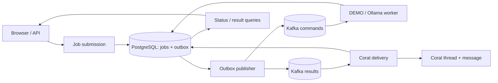

# event-driven-llm

[한국어](README.md) | [English](README.en.md)

An asynchronous LLM execution console for submitting prompts, tracking results, and retrying failed work. Kafka distributes jobs, PostgreSQL preserves execution records, and Coral carries the conversation between draft, review, and revision stages. The web console brings together single and batch execution, stage comparisons, and the current Kafka topology.

**Java 21 · Spring Boot · Kafka · PostgreSQL · Coral Protocol · Optional Ollama**

[Run locally](#run-locally) · [Screenshots](#screenshots) · [Architecture](#architecture) · [Job API](#job-api) · [Real LLM](#real-model-inference) · [Development and verification](#development-and-verification)


## Screenshots

Captured from the running **local Docker application on September 30, 2026**, configured with `qwen2.5:1.5b`. Lists and outputs are actual saved executions. Jev is off because no API key is configured. A completed execution indicates processing and delivery, not a judgment of answer quality. The interface is in Korean.

<details>
<summary>New execution — single, batch, or draft/review/revision</summary>

Choose an execution mode and worker, then enter prompts. This capture shows ten sample prompts entered before submission.


</details>

<details>
<summary>Batch execution — progress and individual results</summary>

Inspect completed and failed jobs, timings, and each saved response alongside its original prompt. Timings belong to this local run.


</details>

<details>
<summary>Collaboration — draft, review, and revision</summary>

A supplied draft and the same model's review and revision appear side by side. The reviewer missed the incorrect draft in this example; pipeline completion and answer quality must be assessed separately.


</details>

<details>
<summary>Kafka — topics, consumers, and partition assignments</summary>

At capture time: one broker, six non-internal topics, and two active consumers. Solid edges show current assignments; dashed edges show configured publication and failure routes. The view refreshes every ten seconds.


</details>

<details>
<summary>Mobile — top navigation and stacked stages</summary>


</details>

## Architecture

Kafka handles work distribution and redelivery; PostgreSQL preserves job state, results, and pending publications. Coral delivers results as conversation messages and lets the next role read earlier context. The project makes model calls traceable as jobs that can resume after failures.



## Use cases and current scope

With a real model connected, prompts can classify customer inquiries and draft replies, extract decisions and action items from meeting notes, or summarize reviews. Submit a job, check its progress, retrieve the saved result, and retry it if it fails.

Kafka buffers incoming work for workers to process. Multiple workers and partitions can support parallel processing. Message order is maintained within a partition; there is no guarantee of global job completion order or throughput proportional to worker count.

| Capability | Implemented behavior |
| --- | --- |
| Durable submission | PostgreSQL job records and transactional outbox |
| Batch submission and timing | Atomic submission of up to 50 prompts, batch progress, per-job queue/inference/total time |
| Jev result evaluation | Optional shadow judgments for fulfillment, faithfulness and language/format; saved probabilities, confidence and history |
| Draft, review and revision | Writer/reviewer roles on the same model, Coral context reads, and side-by-side results |
| Status and results | Web and API queries; results survive app restarts |
| Recovery | Stage-aware manual/automatic retries, expired processing lease recovery, stale attempt fencing |
| Worker routing | Automatic assignment or a registered target worker |
| Kafka visualization | Topic/group discovery and a dynamic graph of individual consumers and actual assignments |
| Inference | DEMO by default; optional real Ollama inference |
| Access and verification | Optional API key, metrics, unit/database/live-service checks |

The input flow supports **single prompts or batches of up to 50 prompts**. File uploads, automatic business-data ingestion, cancellation, and per-user accounts are not implemented. The web interface is currently in Korean; this README provides English setup and development instructions.

## Run locally

Requirements: **Docker with Compose**. Run commands from the project root. The app, Kafka, PostgreSQL, and Coral all run in local Docker containers. In the default mode, only the model response is simulated with a `[DEMO]` prefix. A host JDK is not required to run the containers. Verification scripts require PowerShell (`pwsh` on Linux/macOS).

```powershell
git clone https://github.com/deepwhale-labs/event-driven-llm.git
cd event-driven-llm
docker compose up --build -d
.\scripts\smoke.ps1
```

**Console: http://localhost:18080** — use the sidebar to switch between executions (**실행**), collaboration (**협업**), and Kafka. The execution list and result inspector sit side by side, with prompts and execution metadata in a disclosure. Navigation moves to the top on mobile. Counts summarize the currently displayed execution list.

Open **새 실행** (New execution) to choose a prompt, worker, and execution mode. The form shows the configured DEMO/real-model mode and model name. Choose **일괄 실행** (batch mode) and separate prompts with a line containing `---`. **예시 넣기** fills ten sample prompts without submitting them. Each prompt is limited to 32,000 characters, with a total of 256,000 characters per batch. Validation or persistence failures reject the whole batch. Submit with Ctrl+Enter or ⌘+Enter; close the dialog with Esc.

Reopen a batch using its dedicated link or the recent-batch selector. The view shows success/failure/pending counts, progress, elapsed time, and average inference time. Per-job **queue/inference durations refer to the latest inference attempt**; **total elapsed time includes retries and delivery from the initial submission**. Delivery-only retries retain the original inference timings. Unmeasured timings in older records are shown as `—`.

**Kafka graph: http://localhost:18080/#kafka** — automatically discovers accessible non-internal topics and consumer groups. Nodes change as topics, groups, and individual consumers appear or disappear. Edges change when partitions are reassigned. The visible tab refreshes every 10 seconds; server-side snapshots are shared for 5 seconds.

* **Solid edges:** current topic-partition → consumer assignments. Consumers are identified by member ID and enclosed by their group. Topics without consumers remain visible. Groups with only historical commits do not get active consumption edges.
* **Dashed edges:** DB outbox publication and retry-to-DLT paths known from this app's configuration. External producer relationships are not inferred from Kafka metadata. These edges can be hidden.
* Search, zoom, and select nodes to inspect their connections. Topic details include a group selector for partition leaders, replica/in-sync counts, end/committed offsets, and lag. Offsets remain separate for groups consuming the same topic.
* The view does not consume messages or modify topics or offsets. Unknown values are shown as `—`. During an outage, the last graph is dimmed and labelled with its previous timestamp. Partial lookup failures are not treated as confirmed deletions.

Lag is an offset difference, not a count of unique jobs or retained messages. Edges represent assignments, not a live animation of individual messages. The topology endpoint uses the same optional API-key protection as the other APIs.

| Service | Configuration |
| --- | --- |
| app | Java 21 · Spring Boot 3.5 · Spring AI 1.1 · localhost:18080 |
| database | PostgreSQL 16 · persistent volume · Docker network only |
| broker | Kafka 4.3 · KRaft · localhost:9092 |
| coral | Official Coral Server 1.4.0 · separate JRE 25 · Docker network only |
| ollama | Optional · default model `llama3.2:1b` · localhost:11434 |

## Job API

```powershell
$task = Invoke-RestMethod -Method Post -Uri http://localhost:18080/api/commands `
  -ContentType 'application/json' `
  -Body '{"prompt":"Explain Kafka in one sentence.","targetNode":"local-worker-1"}'

Invoke-RestMethod "http://localhost:18080/api/tasks/$($task.taskId)"
# Query the result after the status response contains an output.
Invoke-RestMethod "http://localhost:18080/api/results/$($task.taskId)"
```

Omit `targetNode`, or set it to `null`, for automatic assignment. Prompts must contain 1–32,000 characters. Unregistered target nodes return `400`. Summarization, classification, and other tasks currently use the same free-form prompt workflow.

Batch jobs use the same routing and retries. All jobs and outbox records in a batch are saved in one database transaction. Completion order may differ from input order.

```powershell
$body = @{ prompts = @('Reply briefly with hello.', 'What is 2 plus 3? Answer briefly.'); targetNode = $null } | ConvertTo-Json
$batch = Invoke-RestMethod -Method Post -Uri http://localhost:18080/api/commands/batch `
  -ContentType 'application/json' -Body $body
Invoke-RestMethod "http://localhost:18080/api/batches/$($batch.summary.batchId)"
```

| Endpoint | Behavior |
| --- | --- |
| `POST /api/commands` | `202`; atomically saves the job and outbox record, returns `taskId` |
| `POST /api/commands/batch` | `202`; `prompts` array of 1–50 items and optional `targetNode`; returns batch summary and jobs |
| `GET /api/batches?limit=10` | Recent batch summaries, up to 50 |
| `GET /api/batches/{batchId}` | Batch summary, all jobs, results, and recorded timestamps |
| `GET /api/runtime` | Configured inference mode/model, output token cap, and batch input limits |
| `GET /api/evaluations/config` | Jev mode, key-presence flag, model and rubric (never the key itself) |
| `GET /api/tasks/{taskId}/evaluations` | Up to 20 recent evaluations for a task |
| `POST /api/tasks/{taskId}/evaluations` | Enqueue evaluation of a saved answer: `202`; unconfigured `503`; no saved answer `409` |
| `GET /api/tasks?status=FAILED&limit=30` | Recent jobs, optional status filter, up to 100 records |
| `GET /api/tasks/{taskId}` | Status, attempt, executing node, output, and failure stage |
| `GET /api/results/{taskId}` | Saved inference result; `404` before output exists or for an unknown job |
| `POST /api/tasks/{taskId}/retry` | Requeues a failed job with `202`; other states return `409` |
| `GET /api/nodes` | Configured routing targets, not a list of currently running workers |
| `GET /api/kafka/topology` | Topic/group discovery, member IDs, assignments, group offsets/lag, configured app routes |
| `GET /api/coral` | Connection/session check: `200` when available, `503` on failure |
| `GET /actuator/health/readiness` | App/database readiness |
| `GET /actuator/metrics/llm.tasks` | Job counts by state |
| `GET /actuator/metrics/llm.outbox.pending` | Pending outbox records |

Jobs progress through `QUEUED → RUNNING → DELIVERING → SUCCEEDED`, or enter `FAILED` after retries are exhausted. `SUCCEEDED` includes delivery to Coral. Inference output is saved before delivery, so it remains queryable during a Coral outage; `threadId` may still be absent at that point.

## Recovery and delivery guarantees

* Job acceptance and its outbox record share one database transaction. A job accepted while Kafka is unavailable remains pending and is published after recovery.
* Workers acquire a database processing lease. Duplicate messages for an already claimed or completed attempt are skipped. Interrupted jobs are recovered after the lease expires, by default after 20 minutes.
* Kafka handlers make the initial attempt plus two retries, then publish to the source topic's `.DLT`. The failure stage is also recorded for valid jobs.
* Automatic requeueing waits 60 seconds after failure and permits two retries by default, taking the job attempt from 1 to at most 3. Set `AUTO_RETRY_MAX=0` for manual-only retries. Expired processing lease recovery uses the same bound.
* Inference failures rerun the model. Delivery failures **reuse the saved output**. Manual retries remain available after the automatic retry limit.
* Late responses from an earlier attempt cannot overwrite the current result. A database lock serializes Coral connection/delivery operations across app instances, and existing messages are checked before delivery.
* Kafka publication is at-least-once. Lost acknowledgements or failed database commits can cause duplicate messages. Distributed exactly-once execution across the model and Coral is not guaranteed.
* Malformed DLT messages and messages without a corresponding database job are not automatically requeued. Inspect those topics directly.

Prompts, results, and job states are stored in PostgreSQL. **Coral sessions and threads remain in memory**: restarting Coral creates a new session. Completed results remain available from the database, but previous Coral threads are not automatically reconstructed. Coral records from before database persistence was added are not automatically imported.

## Real model inference

```powershell
docker compose --profile llm up -d ollama
docker compose exec ollama ollama pull llama3.2:1b
docker compose --profile llm -f docker-compose.yml -f docker-compose.ollama.yml up -d
.\scripts\smoke.ps1 -RequireModel

# With an NVIDIA GPU
docker compose --profile llm -f docker-compose.yml -f docker-compose.ollama.yml -f docker-compose.gpu.yml up -d

# Return to DEMO mode
docker compose up -d app
docker compose --profile llm stop ollama
```

When changing `OLLAMA_MODEL`, pull the matching model name. A failure in real-model mode is not replaced with a DEMO response.

If an existing Ollama process uses port `11434`, set `OLLAMA_PORT=11435` in a local `.env` file to change the container's host port. The app still connects to `ollama:11434` inside Docker. A small model such as `OLLAMA_MODEL=qwen2.5:1.5b` can verify the workflow on a CPU; evaluate output quality before using it for business tasks. `OLLAMA_NUM_PREDICT` caps output tokens and defaults to 512, so longer responses can be truncated. The local `.env` file is excluded from Git.

## Jev result evaluation (shadow mode)

This optional feature calls TypeSafe's [official HTTP API](https://docs.typesafe.ai/api). It defaults to `off` and needs an issued API key for real evaluation. Unlike the local Ollama container, Jev runs through an external API in this setup. Keep the key in your local `.env`, outside Git and the browser.

```dotenv
JEV_MODE=shadow
TYPESAFE_API_KEY=your-key
JEV_MODEL=jev-1.13.0
JEV_CONFIDENCE_THRESHOLD=0.85
```

```powershell
# Preserve real Ollama inference when applying evaluation settings
docker compose -f docker-compose.yml -f docker-compose.ollama.yml --profile llm up -d --build app
```

An independent `jev-evaluator` consumer group subscribes to the result topic and persists evaluation jobs. A separate worker submits the original request and saved answer to Jev, without holding a database lock during HTTP calls. The Kafka graph discovers its active consumer and assignments. A new group starts at the latest offset, avoiding an automatic historical backfill; an existing group resumes its committed offsets. Use **답변 평가** in task details to evaluate older answers.

The rubric checks **task fulfillment, faithfulness to supplied facts, and language/format compliance**. Each check returns `pass / fail / unknown`, probabilities and confidence. A sufficiently confident `fail` yields **REJECT**; all sufficiently confident `pass` yields **PASS**; everything else yields **REVIEW**. The default `0.85` is an unvalidated starting threshold, and confidence is not accuracy. This does not verify external facts, exact arithmetic or schemas. Retrieval of separate reference documents is not implemented.

This version is **shadow-only**. Evaluation failures or negative judgments do not prevent result delivery. `SUCCEEDED` still means delivered, and the UI displays evaluation judgments separately. Automatic regeneration, semantic topic selection and human approval are not enabled.

Each evaluation retains its request/answer snapshot, task attempt, model, rubric version and threshold. Duplicate result events and delivery-only retries do not repeat automatic evaluation of the same answer. Concurrent manual requests share an active job; requests after completion or failure create a new history entry. Older history remains in the database beyond the latest-20 API view.

Connection errors, `429` and `5xx` get up to three attempts with exponential delays and `Retry-After` (capped at five minutes). Authentication errors, malformed responses and oversized inputs are recorded as failed, never accepted. Requests plus answers exceeding 24,000 characters fail without silent truncation. Abandoned jobs recover after a 60-second lease. If shadow mode is enabled without a key, jobs remain pending until the key is configured and the app restarted.

Tests use a mock HTTP provider to verify the protocol, verdict logic, deduplication, recovery and failures. This does not establish real Jev accuracy on Korean content. The [model documentation](https://docs.typesafe.ai/models) describes language-specific performance differences; evaluate your own workload before enabling automatic decisions.

## Draft, review and revision

Open **새 실행** (New execution) and choose **작성 → 검토 → 수정**. Generate a new draft, or check **기존 초안 사용** to supply an existing answer. Compare the three stages in **협업**. The request and supplied draft are each limited to 8,000 characters; generated stage outputs have the same limit.

Each stage reuses the Kafka command/result topics and durable task/outbox records. After publishing the stage output, the next role reads its own `coral://state` MCP resource. That conversation becomes the next task's input. Delivery completion and next-task creation commit together. A failed Coral read does not silently fall back to DB context.

Coral identifies the roles as `writer` and `reviewer`. The Java application runs both roles using the same configured Ollama model and a fixed three-stage sequence. These are not autonomous agents choosing tools or execution order. Jev is a separate optional evaluation feature and is not required for this flow.

The comparison panel shows the draft, review, revision, saved system instructions and user inputs, model execution attempts and cumulative inference time. A new draft normally requires three model executions; a supplied draft requires two. Counts include app-level failed attempts, but not SDK-internal retries, tokens or monetary cost. A process crash can leave the interrupted call's duration unrecorded.

Delivery retries reuse saved output. Inference retries restart only the failed stage. Duplicate result events do not create duplicate successor tasks. If Coral restarts during a flow, the app restores that conversation from durable stage outputs and reads it again. Completed historical threads are not restored in bulk. External inference and Coral sends remain at-least-once.

| API | Behavior |
| --- | --- |
| `POST /api/workflows` | Accept `prompt`, optional `targetNode` and `initialDraft`; returns `202` |
| `GET /api/workflows?limit=10` | Recent flows and their steps; maximum 50 |
| `GET /api/workflows/{id}` | State, input snapshots, outputs, timings and model execution attempts |
| `POST /api/workflows/{id}/retry` | Retry the last failed stage; returns `202` |

Run `.\scripts\workflow.ps1` with real Ollama to record three incorrect drafts, one correct control and one newly generated draft in `build/workflow-live-result.json`. **Completed collaboration does not certify answer quality.** The same small model can approve an incorrect answer or degrade a correct one. Review the recorded outputs before adopting the flow for a workload.

## Worker routing and scaling

Configure the same allowed node list on every app, for example `WORKER_NODES=local-worker-1,local-worker-2`, and give each instance a distinct `APP_NODE_ID`. Instances must share PostgreSQL, Kafka, and the Coral runtime volume. Give additional instances separate host app ports.

Automatic jobs use the shared `llm-commands` topic. Targeted jobs use `llm-commands.<nodeId>`. Jobs for a registered but offline node stay `QUEUED`. Set `WORKER_ENABLED=false` to disable inference consumption on an app instance. Configure the corresponding Ollama connection when deploying workers with different models or model servers.

Topics created by the app default to two partitions and one replica. Within a consumer group, each partition is assigned to one consumer. Consider both worker count and partition count when increasing shared-topic concurrency. Additional workers may not improve throughput if they share a saturated model server.

## Authentication and configuration

| Environment variable | Default / purpose |
| --- | --- |
| `APP_PORT` / `KAFKA_PORT` | `18080` / `9092`, bound to localhost |
| `OLLAMA_PORT` | `11434`, host port of the optional Ollama container |
| `OLLAMA_MODEL` / `OLLAMA_NUM_PREDICT` | `llama3.2:1b` / `512`, model name / output token cap |
| `JEV_MODE` / `TYPESAFE_API_KEY` | `off` / empty; set `shadow` to record judgments; server-only API key |
| `JEV_MODEL` / `JEV_CONFIDENCE_THRESHOLD` | `jev-1.13.0` / `0.85`, model / initial decision threshold |
| `JEV_ENDPOINT` / `JEV_TIMEOUT_MS` | Official `/v1/systemone` HTTPS URL / `15000`, HTTP endpoint / timeout |
| `APP_API_KEY` | Empty for local unauthenticated access; otherwise APIs/metrics require `X-API-Key` |
| `DATABASE_PASSWORD` | Local development default, shared by Compose database/app |
| `DATABASE_URL` / `DATABASE_USER` | Database connection when running outside Docker |
| `AUTO_RETRY_MAX` | `2`, maximum automatic requeues |
| `AUTO_RETRY_DELAY_MS` | `60000`, delay after failure before automatic requeue |
| `PROCESSING_LEASE_MS` | `1200000`, processing lease; set above the longest expected inference duration |
| `APP_NODE_ID` / `WORKER_NODES` | `local-worker-1`, instance identity / allowed targets |

Enter a configured API key in **연결 설정** (Connection settings). It is used only in the current tab and is not persisted in browser storage. Health endpoints expose minimal status without a key. Changing the database password after its volume has been initialized also requires updating the PostgreSQL user's password.

The default stack has one Kafka broker and one PostgreSQL instance. An externally hosted service needs TLS, per-user access control, retention/backup policies, availability planning, and load testing. Diagnostic metrics currently query the database directly.

## Development and verification

Local verification as of September 30, 2026. Passing execution checks does not certify model answer quality.

| Check | Result |
| --- | --- |
| `test bootJar` | 54 passed; 2 opt-in external-service tests skipped; build passed |
| Live integration | Ollama, saved results, Kafka and Coral delivery; routing, batches and timings passed |
| Browser | Live executions, workflows and Kafka; layouts at 390/768/1024/1440px verified |
| UI with mocked responses | Single/batch submission, retries, evaluation history, API keys, dynamic graph changes and recovery passed |
| External Jev API | Not verified without a key; mock HTTP tests completed |

```powershell
# Requires JDK 21 for local builds
.\gradlew.bat test bootJar

# Optional model test against a running Ollama server
# Uses H2 for the database and a test double for Coral delivery
.\gradlew.bat test '-PverifyOllama=true' '-PollamaUrl=http://localhost:11434' '-PollamaModel=llama3.2:1b'

# Live database/Kafka/Coral workflow, routing, results, metrics, topology
.\scripts\smoke.ps1

# Live topology: temporary topic + two consumers, reassignment, cleanup
# Requires the app at localhost:18080 and Kafka at localhost:9092
$env:VERIFY_KAFKA = 'true'
.\gradlew.bat test --tests '*KafkaTopologyLiveTest'
Remove-Item Env:VERIFY_KAFKA

# Temporarily stops/restarts broker, Coral, and app in the target project
.\scripts\recovery.ps1

# Example for a separate verification stack
# .\scripts\recovery.ps1 -BaseUrl http://localhost:18081 -ProjectName event-driven-llm-verify
```

On Linux/macOS, use `./gradlew` (or `bash gradlew`) for Gradle commands and PowerShell for the `.ps1` scripts.

Unit/database tests use H2 in PostgreSQL compatibility mode to exercise transactions, whole-batch rollback, additive schema migration, timing/retry preservation, concurrent claims, duplicate protection, retry limits, stale results, and API authentication. Integration scripts use real PostgreSQL, Kafka, and Coral. GitHub Actions runs tests, builds the app, and runs both integration scripts.

`KafkaTopologyLiveTest` and `RealInferenceTest` are opt-in tests skipped by default. The Kafka test verifies topic creation, consumer counts of 1→2→1→0, partition reassignment, and topic/group deletion through the running API. It removes its temporary resources when it finishes. Set `KAFKA_TEST_BASE_URL` and `KAFKA_TEST_BOOTSTRAP` for other local addresses.

```powershell
docker compose logs -f app coral
docker compose exec broker /opt/kafka/bin/kafka-console-consumer.sh --bootstrap-server broker:19092 --topic llm-results.DLT --from-beginning
docker compose --profile llm down
```

`down` preserves database, Kafka, model, and credential volumes. The Coral image uses the JAR from the [official v1.4.0 release](https://github.com/Coral-Protocol/coral-server/releases/tag/v1.4.0), verifies its SHA-256 checksum, and does not require access to the host Docker socket.

## Next steps

* Validate real Jev judgments, false positives and cost on Korean examples before adding route recommendations and approval/retry policies.
* Select an Ollama model for the intended workload and measure output quality and latency.
* Add file uploads for batch submission and result export.
* Load-test multiple workers and improve queue-time, throughput, and failure diagnostics.
* Add job search, pagination, and queued-job cancellation.
* Integrate the required customer inquiry, review, or other business-data sources.
* Before external hosting, add per-user permissions, TLS, backups/retention, alerts, and availability measures.

## Repository file policy

Git includes documentation, Java source/tests, shared configuration, web assets, Docker files, CI, and verification scripts. Personal credentials, private connection configuration, runtime databases, models, logs, and local settings are excluded. [.gitignore](.gitignore) and [.dockerignore](.dockerignore) allow only the required files.
