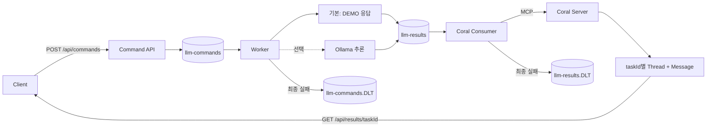
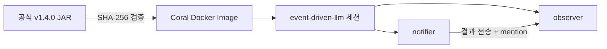

# event-driven-llm

**Kafka → Worker → Coral Protocol** · Java 21 · GPU 없이 시작



| 서비스 | 실행 환경 | 접속 |
| --- | --- | --- |
| `app` | **Java 21** · Spring Boot 3.5 · Spring AI 1.1 | `localhost:18080` |
| `broker` | Kafka 4.3 · KRaft | `localhost:9092` |
| `coral` | 공식 Coral Server **1.4.0** · 별도 JRE 25 | Docker 내부 `coral:5555` |
| `ollama` | 선택 실행 · `llama3.2:1b` | `localhost:11434` |

## Quick start

필수: **Docker + Compose**. 기본 모드는 Kafka와 Coral을 실제로 실행하고, 추론만 `[DEMO]` 응답으로 대체합니다.

```bash
docker compose up --build -d
```

**PowerShell · 전체 흐름 확인**

```powershell
.\scripts\smoke.ps1
```

**직접 요청 / 결과 조회**

```powershell
Invoke-RestMethod http://localhost:18080/api/coral

$task = Invoke-RestMethod -Method Post `
  -Uri http://localhost:18080/api/commands `
  -ContentType 'application/json' `
  -Body '{"prompt":"Explain Kafka in one sentence."}'

# 처리가 끝난 뒤 조회 · 처리 전에는 404
Invoke-RestMethod "http://localhost:18080/api/results/$($task.taskId)"
```

```json
{
  "taskId": "<요청 UUID>",
  "threadId": "<실제 Coral 스레드 UUID>",
  "nodeId": "local-worker-1",
  "output": "[DEMO - no model inference] Received: Explain Kafka in one sentence."
}
```

| API | 응답 |
| --- | --- |
| `POST /api/commands` | `202` · Kafka 접수 · `taskId` |
| `GET /api/coral` | `200` · Coral 연결 및 세션 확인 / `503` · 연결 실패 |
| `GET /api/results/{taskId}` | `200` · Coral에 기록된 결과 / `404` · 현재 세션에 결과 없음 |

## 실제 LLM · 선택

```bash
# 모델 다운로드
docker compose --profile llm up -d ollama
docker compose exec ollama ollama pull llama3.2:1b

# 실제 추론으로 전환
docker compose --profile llm -f docker-compose.yml -f docker-compose.ollama.yml up -d

# NVIDIA GPU가 있는 경우
docker compose --profile llm -f docker-compose.yml -f docker-compose.ollama.yml -f docker-compose.gpu.yml up -d

# DEMO 모드로 복귀
docker compose up -d app
docker compose --profile llm stop ollama
```

모델 변경: `OLLAMA_MODEL` 지정 후 같은 모델을 다운로드합니다. 실제 추론 실패 시 DEMO로 자동 대체하지 않습니다.

## Coral 구성



| 항목 | 동작 |
| --- | --- |
| 배포 파일 | [공식 릴리스](https://github.com/Coral-Protocol/coral-server/releases/tag/v1.4.0) · [Dockerfile에 해시 고정](docker/coral/Dockerfile) |
| 연결 방식 | `agent-hub`와 같은 공식 JAR + executable endpoint + MCP |
| 격리 | 별도 서버·세션·볼륨 · 호스트 Docker 소켓 불필요 |
| 인증 | 실행 시 난수 키 생성 · 전용 볼륨 보관 · 앱은 읽기 전용 마운트 |
| 중복 처리 | 단일 앱에서 같은 `taskId`의 기존 Coral 메시지를 확인 후 전송 |
| 앱 재시작 | 실행 중인 Coral 세션 재사용 |
| Coral 재시작 | 새 세션 자동 생성 · **기존 스레드/메시지는 복구되지 않음** |

Coral은 에이전트 간 통신 서버입니다. 현재 결과 확인 화면은 별도로 없으며 조회 API를 제공합니다.

## 개발 · 확인

```powershell
# JDK 21
.\gradlew.bat test bootJar

# 실제 Kafka → Coral 검증
.\scripts\smoke.ps1
```

```bash
# 로그
docker compose logs -f app coral

# 전송 실패 메시지 · 추론 실패는 llm-commands.DLT
docker compose exec broker /opt/kafka/bin/kafka-console-consumer.sh --bootstrap-server broker:19092 --topic llm-results.DLT --from-beginning

# 종료 · Kafka/인증키 볼륨 유지
docker compose --profile llm down
```

## 현재 범위

| 구분 | 상태 |
| --- | --- |
| 기본 실행 | 실제 Kafka·Coral + DEMO Worker |
| 실제 모델 | Ollama 연결 코드 제공 · 모델 추론 검증은 별도 |
| 오류 처리 | 최초 처리 + 재시도 2회 → 해당 토픽의 `.DLT` |
| 미구현 | 업무 시나리오 · Coral 기록 영속화 · DLT 재처리 자동화 · 노드별 라우팅 |
| 처리 보장 | Kafka 결과는 중복 가능 · Coral 중복 확인은 현재 세션·단일 앱 범위 |
| 개발 환경 | 단일 Kafka · 앱 API 인증 없음 · 호스트 포트는 localhost에만 공개 |
| 포트 변경 | `APP_PORT` 지정 · 기본 `18080` |

## 파일 정책

| Git 포함 | Git 제외 |
| --- | --- |
| Java·테스트·Gradle·Docker 정의·README·검증 스크립트 | 인증키·접속 URL·JAR·모델·로그·실행 데이터·개인 설정 |

[.gitignore](.gitignore)는 기본 차단 + 명시적 허용 방식입니다. Gradle Wrapper JAR만 빌드 도구로 포함합니다. 앱과 Coral 각각의 Docker context도 필요한 파일만 전달합니다.

```bash
git diff --cached
```
