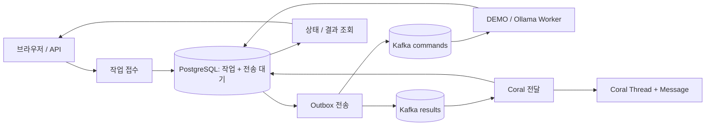

# event-driven-llm

[한국어](README.md) | [English](README.en.md)

프롬프트를 작업으로 접수하고, Kafka를 통해 Worker가 처리한 결과를 PostgreSQL에 저장하고 Coral로 전달하는 비동기 LLM 작업 처리 프로젝트입니다. 웹 화면에서 요청·상태·결과·재시도를 관리하고, 동적 Kafka 그래프로 실제 토픽과 Consumer 연결 관계를 확인합니다.

**Java 21 · Spring Boot · Kafka · PostgreSQL · Coral Protocol · 선택적 Ollama**



## 사용 예시와 현재 범위

실제 LLM을 연결하면 고객 문의의 분류·답변 초안, 회의록의 결정 사항·할 일 정리, 리뷰 요약 등을 프롬프트로 요청할 수 있습니다. 작업 접수 후 화면에서 처리 상태와 저장된 결과를 확인하며 실패한 작업은 다시 실행할 수 있습니다.

요청이 몰리면 Kafka에 대기시키고 Worker가 처리합니다. 여러 Worker와 파티션으로 병렬 처리할 수 있으며 메시지 순서는 파티션 안에서 보장됩니다. 전체 작업의 완료 순서나 Worker 수에 비례하는 처리 속도를 보장하지는 않습니다.

| 기능 | 현재 구현 |
| --- | --- |
| 작업 접수·보존 | PostgreSQL 작업 저장 + 트랜잭션 Outbox |
| 일괄 접수·시간 측정 | 최대 50개 프롬프트의 원자적 접수, 묶음 진행률, 작업별 대기·추론·전체 시간 |
| 처리 상태·결과 | 웹 화면과 API에서 조회, 앱 재시작 후에도 결과 유지 |
| 재처리 | 단계별 수동·자동 재시도, 처리권 만료 복구, 이전 시도 결과 차단 |
| 노드 라우팅 | 자동 배정 또는 등록된 Worker 지정 |
| Kafka 시각화 | 토픽·그룹 자동 발견, 개별 Consumer와 파티션 할당의 동적 연결도 |
| 모델 | 기본 DEMO, 선택적으로 Ollama 실제 추론 |
| 접근 제어·검증 | 선택적 API 키, 메트릭, 단위·DB·실제 서비스 검증 |

입력은 **프롬프트 개별 접수 또는 최대 50개 일괄 접수**를 지원합니다. 파일 업로드, 업무 시스템 자동 수집, 작업 취소와 사용자별 계정은 아직 구현하지 않았습니다. 웹 화면은 한국어이며 영문 README는 실행·개발 안내를 제공합니다.

## 실행

필수: **Docker + Compose**. 프로젝트 루트에서 실행합니다. 앱·Kafka·PostgreSQL·Coral은 모두 로컬 Docker 컨테이너이며, 기본 모드에서는 모델 응답만 `[DEMO]`로 생성합니다. 컨테이너 실행에는 호스트 JDK가 필요하지 않습니다. 검증 스크립트는 PowerShell을 사용합니다.

```powershell
docker compose up --build -d
.\scripts\smoke.ps1
```

**작업 화면: http://localhost:18080** — 요청, 노드 선택, 상태 조회, 결과 확인, 실패 재시도.

화면에 현재 설정된 DEMO/실제 LLM 모드와 모델명이 표시됩니다. **여러 건 한 번에**를 선택하고 각 요청 사이에 `---` 한 줄을 넣으면 묶음으로 접수합니다. **예시 10개 채우기**는 입력만 채우며, 접수 버튼을 눌러 실행합니다. 각 요청은 최대 32,000자, 묶음 전체는 최대 256,000자입니다. 입력 검증·저장 실패 시 묶음 전체를 접수하지 않습니다.

묶음은 전용 링크와 최근 묶음 선택 메뉴로 다시 열 수 있습니다. 완료·실패·진행 중 개수, 진행률, 전체 경과와 평균 추론 시간이 표시됩니다. 각 작업의 **대기·추론은 최근 추론 시도 기준**, **전체 시간은 최초 접수부터 재시도·결과 전달을 포함**합니다. 결과 전달만 재시도할 때는 기존 추론 시간이 유지됩니다. 측정 항목 도입 전 기록의 미측정 값은 `—`로 표시합니다.

**Kafka 구성 탭: http://localhost:18080/#kafka** — 조회 권한이 있는 일반 토픽과 Consumer 그룹을 자동 발견하는 동적 연결도입니다. 토픽·그룹·개별 Consumer가 추가·제거되면 상자가 바뀌고, 리밸런싱 시 실제 할당 파티션에 따라 연결선이 갱신됩니다. 내부 관리 토픽은 제외합니다. 10초마다 갱신하며 서버 조회는 5초간 공유 캐시합니다.

* **실선**: 현재 토픽 파티션 → Consumer 할당. 그룹은 큰 테두리로 묶고 Consumer는 member ID로 구분합니다. Consumer가 없는 토픽도 표시하며, 커밋 이력만 남은 그룹에 활성 소비 연결선을 만들지 않습니다.
* **점선**: 앱 설정으로 확인한 DB Outbox 발행·재시도 후 DLT 경로. Kafka 메타데이터만으로 외부 Producer의 발행 관계를 자동 추론하지 않습니다. 점선은 표시를 끌 수 있습니다.
* 검색, 확대·축소, 노드 선택으로 연결 관계를 살펴봅니다. 토픽 상세에서는 그룹을 선택해 파티션 리더, 복제본/동기화 수, 끝·커밋 오프셋과 Lag를 확인합니다. 같은 토픽을 읽는 여러 그룹의 오프셋을 구분합니다.
* 메시지를 소비하거나 오프셋·토픽을 변경하지 않는 조회 화면입니다. 조회 불가 값은 `—`로 표시합니다. 연결 장애 시 마지막 연결도를 흐리게 유지하고 이전 조회 시각을 표시합니다. 일부 조회 실패는 구성 삭제로 판단하지 않습니다.

Lag는 오프셋 차이로, 고유 작업 수나 보관된 메시지 수를 뜻하지 않습니다. 연결선은 현재 할당 관계이며 실제 메시지 이동 애니메이션이 아닙니다. API 키가 설정되면 연결도 조회에도 동일하게 적용됩니다.

| 서비스 | 구성 |
| --- | --- |
| app | Java 21 · Spring Boot 3.5 · Spring AI 1.1 · localhost:18080 |
| database | PostgreSQL 16 · 전용 영속 볼륨 · Docker 내부 전용 |
| broker | Kafka 4.3 · KRaft · localhost:9092 |
| coral | 공식 Coral Server 1.4.0 · 별도 JRE 25 · Docker 내부 전용 |
| ollama | 선택 실행 · 기본 모델 llama3.2:1b · localhost:11434 |

## 작업 API

```powershell
$task = Invoke-RestMethod -Method Post -Uri http://localhost:18080/api/commands `
  -ContentType 'application/json' `
  -Body '{"prompt":"Explain Kafka in one sentence.","targetNode":"local-worker-1"}'

Invoke-RestMethod "http://localhost:18080/api/tasks/$($task.taskId)"
# 상태 조회에서 output이 생성된 것을 확인한 뒤 결과 조회
Invoke-RestMethod "http://localhost:18080/api/results/$($task.taskId)"
```

`targetNode` 생략 또는 `null`은 자동 배정입니다. 요청은 1~32,000자이며, 등록되지 않은 노드는 `400`으로 거절합니다. 현재 업무 흐름은 자유 형식 프롬프트 처리입니다. 요약·분류 등의 요청도 프롬프트로 전달합니다.

일괄 접수도 같은 노드 라우팅과 실패 재시도를 사용합니다. 묶음은 작업과 Outbox를 한 DB 트랜잭션에 저장하며, 작업 완료 순서는 입력 순서와 다를 수 있습니다.

```powershell
$body = @{ prompts = @('Reply briefly with hello.', 'What is 2 plus 3? Answer briefly.'); targetNode = $null } | ConvertTo-Json
$batch = Invoke-RestMethod -Method Post -Uri http://localhost:18080/api/commands/batch `
  -ContentType 'application/json' -Body $body
Invoke-RestMethod "http://localhost:18080/api/batches/$($batch.summary.batchId)"
```

| API | 동작 |
| --- | --- |
| `POST /api/commands` | `202` · 작업과 Kafka 전송 대기 기록을 DB에 함께 저장 · taskId 반환 |
| `POST /api/commands/batch` | `202` · `prompts` 배열 1~50개, 선택적 `targetNode` · 묶음 요약과 작업 목록 반환 |
| `GET /api/batches?limit=10` | 최근 묶음 요약 · 최대 50개 |
| `GET /api/batches/{batchId}` | 묶음 요약·전체 작업·결과·측정 시각 |
| `GET /api/runtime` | 설정된 DEMO/실제 추론 모드, 모델, 응답 토큰 상한, 묶음 입력 제한 |
| `GET /api/tasks?status=FAILED&limit=30` | 최근 작업 목록 · 상태 필터 선택 · 최대 100개 |
| `GET /api/tasks/{taskId}` | 상태·시도 번호·실행 노드·결과·실패 단계 |
| `GET /api/results/{taskId}` | DB에 저장한 추론 결과 · 결과 생성 전/없는 작업은 `404` |
| `POST /api/tasks/{taskId}/retry` | 실패 작업 재접수 `202` · 실패 상태가 아니면 `409` |
| `GET /api/nodes` | 라우팅 가능한 노드 목록 · 실행 중 여부를 나타내지는 않음 |
| `GET /api/kafka/topology` | 일반 토픽·Consumer 그룹 자동 발견, member ID·실제 할당, 그룹별 오프셋·Lag, 앱 설정 경로 · API 키 설정 적용 |
| `GET /api/coral` | 연결·세션 확인 `200` / 연결 실패 `503` |
| `GET /actuator/health/readiness` | 앱·DB 준비 상태 |
| `GET /actuator/metrics/llm.tasks` | 상태별 작업 수 |
| `GET /actuator/metrics/llm.outbox.pending` | Kafka 전송 대기 수 |

상태는 `QUEUED → RUNNING → DELIVERING → SUCCEEDED`이며, 재시도 소진 시 `FAILED`입니다. `SUCCEEDED`는 Coral 전달까지 완료됐다는 뜻입니다. 추론 결과는 전달 전에 저장하므로 Coral 장애 중에도 결과 조회가 가능합니다. 이때 `threadId`는 아직 없을 수 있습니다.

## 복구와 처리 보장

* 접수와 전송 대기 기록을 한 DB 트랜잭션으로 저장합니다. Kafka가 중단되어도 접수된 작업은 전송 대기 상태로 남고, 복구 후 전송합니다.
* Worker는 DB에서 처리권을 획득합니다. 동일 작업·시도의 중복 메시지는 건너뜁니다. 앱이 중단된 작업은 기본 20분의 처리권 만료 후 회수합니다.
* 각 Kafka 처리에서 최초 시도와 재시도 2회 후 해당 토픽의 `.DLT`로 보냅니다. 유효한 작업은 DB에 실패 단계도 기록합니다.
* 기본 자동 재접수는 60초 간격, 최대 2회입니다. 시도 번호는 최초 1에서 최대 3까지 증가합니다. `AUTO_RETRY_MAX=0`이면 수동 재시도만 사용합니다. Worker 중단 복구에도 같은 한도를 적용합니다.
* 추론 실패는 모델을 다시 실행하고, Coral 전달 실패는 **저장한 결과만 다시 전송**합니다. 수동 재시도는 자동 재접수 한도 이후에도 가능합니다.
* 이전 시도의 늦은 응답은 현재 결과를 덮어쓰지 못합니다. Coral 연결·전송은 DB 잠금으로 앱 간 순서를 보장하고 기존 메시지를 확인합니다.
* Kafka 전송은 at-least-once입니다. 네트워크 응답 유실이나 DB 커밋 실패 시 메시지가 중복될 수 있습니다. 외부 모델 호출·Coral까지 분산 exactly-once를 보장하지는 않습니다.
* 형식이 잘못됐거나 DB 작업과 연결되지 않은 DLT 메시지는 자동 재접수하지 않습니다. 해당 토픽에서 직접 확인합니다.

DB에는 프롬프트·결과·상태가 남습니다. **Coral 자체의 세션·스레드는 여전히 메모리 상태**이므로 Coral 재시작 시 새 세션을 생성합니다. 이미 완료한 작업의 결과 조회는 DB에서 계속 제공하지만 이전 Coral 스레드를 자동 복원하지는 않습니다. 기능 추가 이전의 Coral 기록은 DB로 자동 이관하지 않습니다.

## 실제 LLM

```powershell
docker compose --profile llm up -d ollama
docker compose exec ollama ollama pull llama3.2:1b
docker compose --profile llm -f docker-compose.yml -f docker-compose.ollama.yml up -d
.\scripts\smoke.ps1 -RequireModel

# NVIDIA GPU가 있는 경우
docker compose --profile llm -f docker-compose.yml -f docker-compose.ollama.yml -f docker-compose.gpu.yml up -d

# DEMO 모드로 복귀
docker compose up -d app
docker compose --profile llm stop ollama
```

`OLLAMA_MODEL` 변경 시 같은 이름의 모델을 다운로드합니다. 실제 모델 실패를 DEMO로 대체하지 않습니다.

Windows 등에서 기존 Ollama가 `11434`를 사용 중이면 로컬 `.env`에 `OLLAMA_PORT=11435`를 지정해 프로젝트 컨테이너의 호스트 포트를 바꿀 수 있습니다. 앱은 계속 Docker 내부의 `ollama:11434`에 연결합니다. CPU 환경에서는 `OLLAMA_MODEL=qwen2.5:1.5b` 같은 경량 모델로 흐름을 검증할 수 있으며, 업무 적용 전 결과 품질을 확인해야 합니다. `OLLAMA_NUM_PREDICT`는 응답 토큰 상한으로 기본 512이며, 길이에 따라 출력이 잘릴 수 있습니다. `.env`는 Git에 포함되지 않습니다.

## 노드 라우팅

`WORKER_NODES=local-worker-1,local-worker-2`처럼 허용 노드를 모든 앱에 동일하게 설정하고 각 인스턴스에 서로 다른 `APP_NODE_ID`를 지정합니다. 모든 인스턴스는 같은 DB·Kafka·Coral 런타임 볼륨을 사용해야 합니다. 추가 인스턴스에는 별도 호스트 앱 포트를 지정합니다.

자동 배정은 `llm-commands`를 공유 소비하고, 지정 요청은 `llm-commands.<nodeId>`로 전달합니다. 등록됐지만 실행되지 않은 노드의 작업은 `QUEUED`로 대기합니다. `WORKER_ENABLED=false`이면 해당 앱의 추론 소비를 끌 수 있습니다. 노드 수·모델별로 배포할 때는 각각의 Ollama 연결도 지정합니다.

앱이 생성하는 각 토픽은 기본 파티션 2개·복제본 1개입니다. 동일 그룹에서 한 파티션은 한 Consumer에 할당되므로, 공유 요청 토픽의 병렬 소비를 확장할 때는 Worker 수와 파티션 수를 함께 검토해야 합니다. Worker를 추가해도 하나의 모델 서버가 병목이면 처리량이 늘지 않을 수 있습니다.

## 인증·운영 설정

| 환경 변수 | 기본값 / 용도 |
| --- | --- |
| `APP_PORT` / `KAFKA_PORT` | `18080` / `9092` · localhost 바인딩 |
| `OLLAMA_PORT` | `11434` · 선택적 Ollama 컨테이너의 호스트 포트 |
| `OLLAMA_MODEL` / `OLLAMA_NUM_PREDICT` | `llama3.2:1b` / `512` · 모델명 / 응답 토큰 상한 |
| `APP_API_KEY` | 비어 있으면 로컬 인증 생략 · 지정 시 API·메트릭에 `X-API-Key` 헤더 필수 |
| `DATABASE_PASSWORD` | 로컬 개발 기본값 · Compose DB와 앱에 함께 적용 |
| `DATABASE_URL` / `DATABASE_USER` | Docker 외부 실행 시 PostgreSQL 접속 설정 |
| `AUTO_RETRY_MAX` | `2` · 자동 재접수 횟수 |
| `AUTO_RETRY_DELAY_MS` | `60000` · 실패 후 자동 재접수 대기 |
| `PROCESSING_LEASE_MS` | `1200000` · Worker 처리권 유지 시간 · 최장 모델 실행 시간보다 길게 설정 |
| `APP_NODE_ID` / `WORKER_NODES` | `local-worker-1` · 실행 노드 / 허용 노드 목록 |

API 키를 설정한 경우 브라우저의 접근 키 입력란을 사용합니다. 키는 브라우저 저장소에 저장하지 않습니다. 헬스 체크는 키 없이 최소 상태만 공개합니다. PostgreSQL 비밀번호를 기존 볼륨 생성 후 바꾸려면 DB 사용자 비밀번호도 함께 변경해야 합니다.

이 구성은 단일 Kafka·단일 PostgreSQL 기반입니다. 외부 서비스 배포에는 TLS, 사용자별 권한, 데이터 보존·백업 정책, 가용성 구성과 부하 검증을 추가해야 합니다. 메트릭은 진단 조회용이며 DB를 직접 집계합니다.

## 개발·검증

```powershell
# JDK 21
.\gradlew.bat test bootJar

# 실행 중인 Ollama로 모델 연동 테스트 (DB는 H2, Coral 전달은 테스트 대역)
.\gradlew.bat test '-PverifyOllama=true' '-PollamaUrl=http://localhost:11434' '-PollamaModel=llama3.2:1b'

# 실제 서비스 연동, 자동/지정 노드 처리, 결과 저장, 메트릭
.\scripts\smoke.ps1

# 동적 Kafka 구성 검증: 임시 토픽과 Consumer 2개 생성 → 재할당 → 제거 확인
# 실행 중인 localhost:18080 앱과 localhost:9092 Kafka가 필요하며 테스트 항목은 종료 시 정리됩니다.
$env:VERIFY_KAFKA = 'true'
.\gradlew.bat test --tests '*KafkaTopologyLiveTest'
Remove-Item Env:VERIFY_KAFKA

# 대상 Compose 프로젝트의 broker/Coral/app을 잠시 중단·재시작하는 장애 검증
.\scripts\recovery.ps1

# 별도 프로젝트에서 검증할 경우
# .\scripts\recovery.ps1 -BaseUrl http://localhost:18081 -ProjectName event-driven-llm-verify
```

단위·DB 테스트는 H2의 PostgreSQL 호환 모드로 트랜잭션, 일괄 접수 전체 롤백, 기존 스키마의 추가 마이그레이션, 시간 기록·재시도 보존, 동시 처리권, 중복 방지, 재접수 한도, 늦은 응답 차단, API 인증을 확인합니다. 통합 스크립트는 실제 PostgreSQL·Kafka·Coral을 사용합니다. GitHub Actions는 테스트·빌드와 두 통합 스크립트를 실행합니다.

`KafkaTopologyLiveTest`와 `RealInferenceTest`는 외부 서비스가 필요한 선택 테스트이며 기본 실행에서는 건너뜁니다. Kafka 선택 테스트는 임시 토픽 생성, Consumer 1→2→1→0개 변화, 파티션 재할당, 테스트 토픽·그룹 삭제의 API 반영을 확인합니다. 다른 로컬 주소를 사용할 때는 `KAFKA_TEST_BASE_URL`과 `KAFKA_TEST_BOOTSTRAP`을 설정합니다.

```powershell
docker compose logs -f app coral
docker compose exec broker /opt/kafka/bin/kafka-console-consumer.sh --bootstrap-server broker:19092 --topic llm-results.DLT --from-beginning
docker compose --profile llm down
```

`down`은 DB·Kafka·모델·인증키 볼륨을 유지합니다. Coral 이미지는 [공식 v1.4.0 릴리스](https://github.com/Coral-Protocol/coral-server/releases/tag/v1.4.0)의 JAR을 SHA-256 검증 후 사용하며 호스트 Docker 소켓을 요구하지 않습니다.

## 다음 작업

* 실제 업무에 맞는 Ollama 모델을 선택하고 응답 품질·처리시간 측정.
* 파일 업로드를 통한 일괄 등록과 결과 내보내기.
* 다중 Worker 부하 테스트, 대기시간·처리량·실패 원인 표시 강화.
* 작업 검색·페이지 이동·대기 작업 취소.
* 고객 문의·리뷰 등 필요한 업무 시스템 연동.
* 외부 서비스 제공 시 사용자별 권한, TLS, 백업·보존 정책, 장애 알림과 가용성 보강.

## 파일 정책

Git에는 문서·Java·테스트·공통 설정·화면·Docker·CI·검증 스크립트를 포함합니다. 개인 인증키·비공개 접속 설정·런타임 DB·모델·로그·개인 설정은 제외합니다. [.gitignore](.gitignore)와 [.dockerignore](.dockerignore)는 필요한 파일만 허용합니다.
