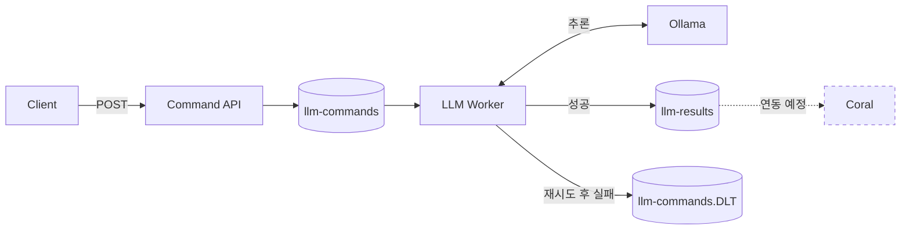

# event-driven-llm

**Kafka → 로컬 LLM → 결과 이벤트**

## Architecture



| 서비스 | 역할 / 스택 | 로컬 포트 |
| --- | --- | --- |
| `app` | Command API + Worker · Java 21 · Spring Boot 3.5 · Spring AI 1.1 | `8080` |
| `broker` | 메시지 보관 · Kafka 4.3 · KRaft | `9092` |
| `ollama` | 로컬 추론 · `llama3.2:1b` | `11434` |

## Quick start

필수: **Docker + Compose**

```bash
docker compose up -d --wait broker ollama
docker compose exec ollama ollama pull llama3.2:1b
docker compose up --build -d app
```

### 1. 명령 전송

**PowerShell**

```powershell
Invoke-RestMethod -Method Post `
  -Uri http://localhost:8080/api/commands `
  -ContentType 'application/json' `
  -Body '{"prompt":"Explain Kafka in one sentence."}'
```

**`202 Accepted` → `taskId` 반환 · Kafka 접수**

**Bash / curl**

```bash
curl -X POST http://localhost:8080/api/commands \
  -H 'Content-Type: application/json' \
  -d '{"prompt":"Explain Kafka in one sentence."}'
```

### 2. 결과 확인

```bash
docker compose exec broker /opt/kafka/bin/kafka-console-consumer.sh --bootstrap-server broker:19092 --topic llm-results --from-beginning
```

**결과 메시지 예시**

```json
{
  "taskId": "<요청 시 반환된 UUID>",
  "nodeId": "local-worker-1",
  "output": "<모델 응답>"
}
```

## Options

### NVIDIA GPU

Quick start 이후, Docker GPU 사용이 설정된 호스트에서:

```bash
docker compose -f docker-compose.yml -f docker-compose.gpu.yml up --build -d
```

### 로컬 개발 · JDK 21

Quick start의 Kafka·Ollama를 사용합니다.

```powershell
docker compose stop app
.\gradlew.bat bootRun
```

macOS / Linux: `./gradlew bootRun`

### 실패 메시지 · 로그 · 종료

```bash
# 실패 메시지
docker compose exec broker /opt/kafka/bin/kafka-console-consumer.sh --bootstrap-server broker:19092 --topic llm-commands.DLT --from-beginning

# 앱 로그
docker compose logs -f app

# 종료 · 데이터 볼륨 유지
docker compose down
```

## 설정 · 현재 범위 · 파일 정책

| 항목 | 설정 |
| --- | --- |
| 모델 변경 | `OLLAMA_MODEL` 지정 + 해당 모델 사전 다운로드 |
| 처리 방식 | 메시지 1건씩 · poll 간격 상한 15분 |
| 개발 환경 | 단일 브로커 · 평문 연결 · localhost 포트 공개 |
| 추후 구현 | Coral · 노드별 라우팅 · 결과 중복 제거 · 장시간 추론 제어 |
| 운영 전 결정 | 네트워크 경계 · 인증·암호화 · Kafka 복제·보관 기간 |

결과 발행 후 오프셋 확정 전에 종료되면 같은 `taskId`의 결과가 중복될 수 있습니다.

| 파일 정책 | 대상 |
| --- | --- |
| Git 허용 | Java · 공용 설정 · Gradle·Docker 정의 · 저장소 설정 · README |
| Git 제외 | `.env` · 키·인증서 · 로그·덤프 · 모델·데이터 · 빌드 결과 |
| Docker 전달 | 빌드 정의 · main Java 소스 · 공용 설정 |

새 경로는 [.gitignore](.gitignore) 허용 목록에 추가합니다. 비밀값은 환경 변수로 주입합니다. Ignore는 소스 내용이나 이미 추적 중인 파일을 검사하지 않습니다.

```bash
git diff --cached
```
