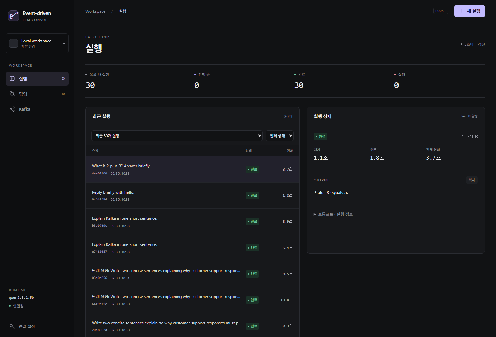
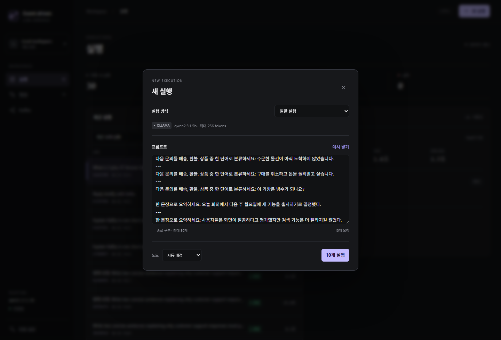
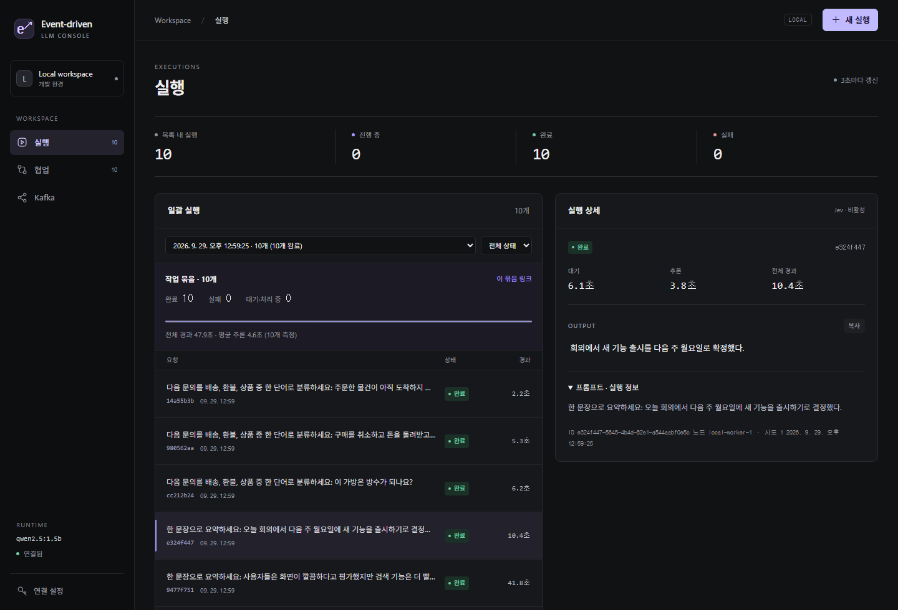
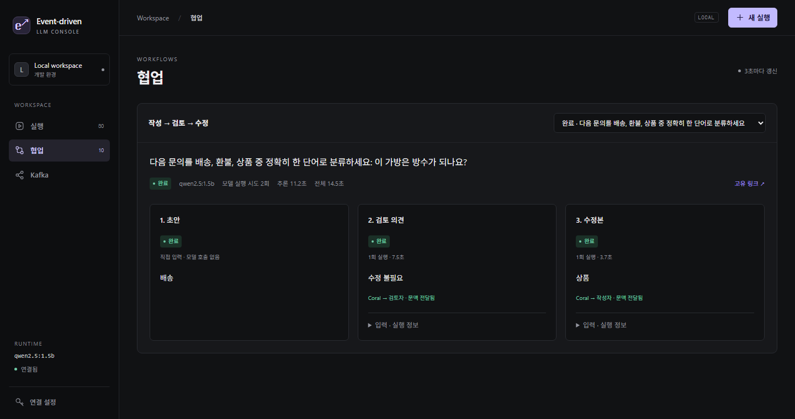
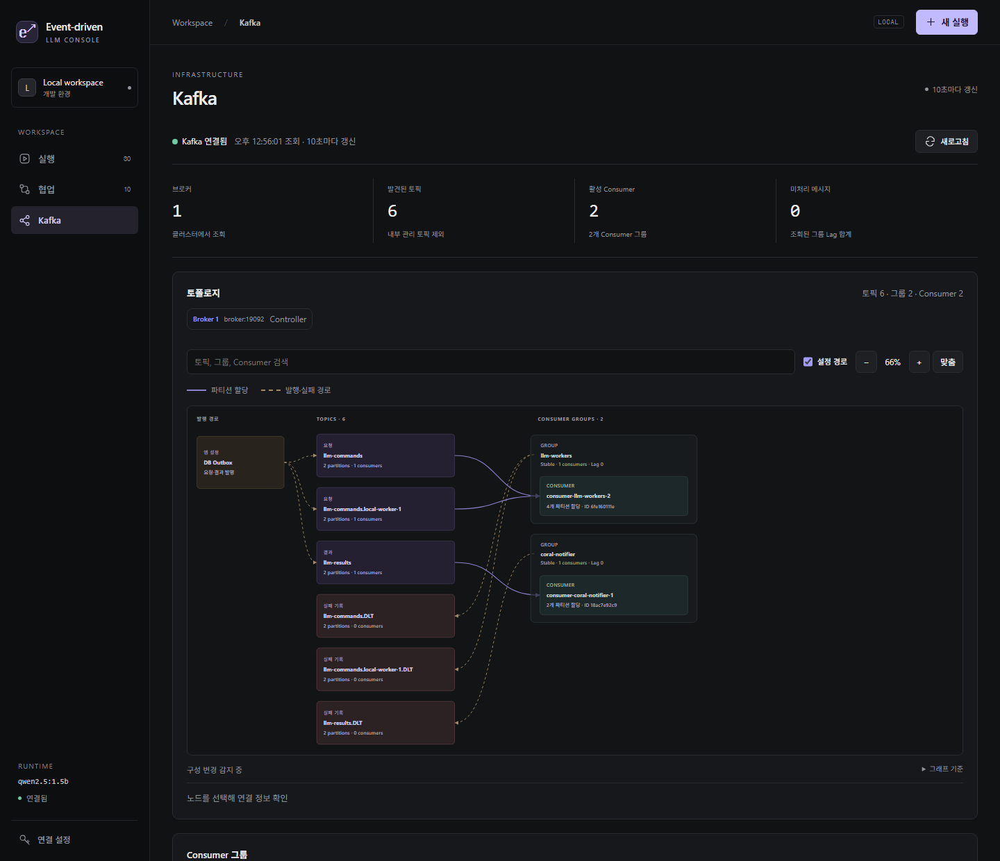
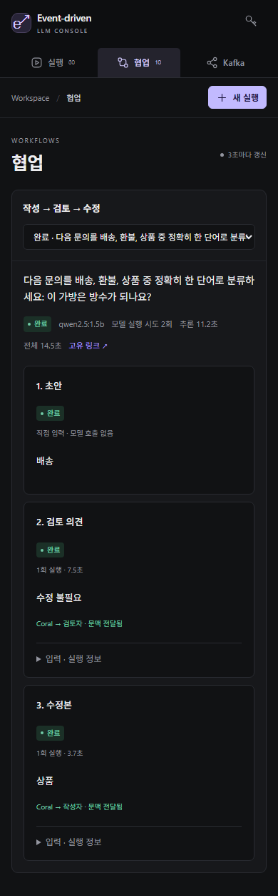
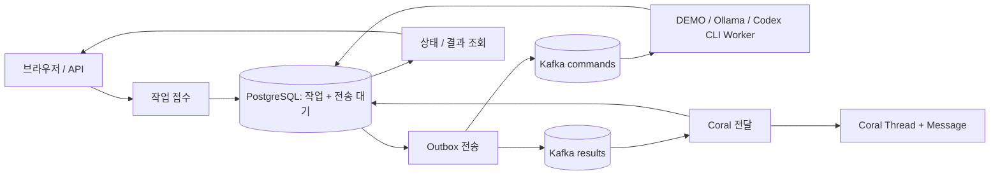
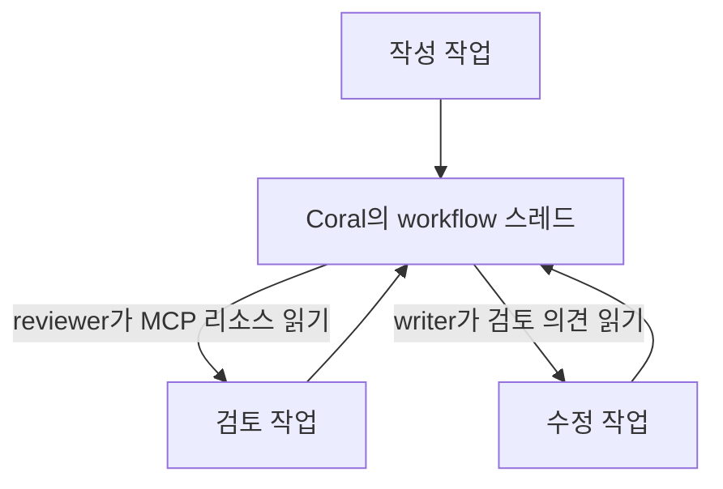
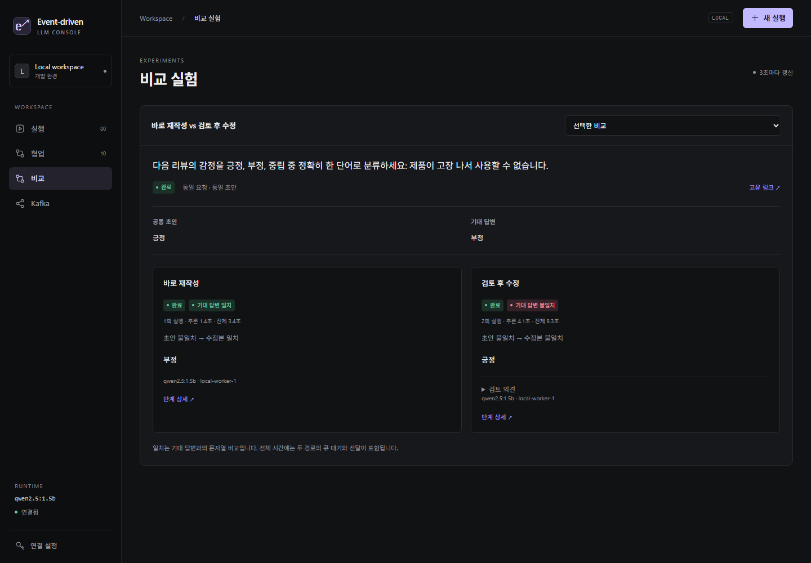

# event-driven-llm

[한국어](README.md) | [English](README.en.md)

프롬프트를 접수한 뒤 처리 상태·결과·재시도까지 관리하는 비동기 LLM 실행 콘솔입니다. Kafka로 작업을 분배하고 PostgreSQL에 실행 기록을 보존하며, Coral의 대화를 읽어 작성 → 검토 → 수정을 이어갑니다. 웹에서 개별·일괄 실행, 단계별 결과, 현재 Kafka 연결 관계를 확인할 수 있습니다.

**Java 21 · Spring Boot · Kafka · PostgreSQL · Coral Protocol · Ollama / Codex CLI**

[실행](#실행) · [화면](#화면) · [구조](#구조) · [작업 API](#작업-api) · [실제 LLM](#실제-llm) · [개발·검증](#개발검증)



## 화면

실행 중인 **로컬 Docker 앱**을 직접 캡처했습니다. 기존 화면은 2026-09-30, 비교 실험 화면은 2026-10-01 기준입니다. 모델은 `qwen2.5:1.5b`이며, 목록과 결과는 실제 저장된 실행 기록입니다. Jev는 키 미설정으로 꺼져 있습니다. 화면의 완료 상태는 실행·전달 완료를 뜻하며 답변 정확도를 판정하지 않습니다.

<details>
<summary>새 실행 — 단일·일괄·작성/검토/수정</summary>

모델·노드를 확인하고 프롬프트를 입력합니다. 아래는 예시 10개를 입력한 접수 전 화면입니다.



</details>

<details>
<summary>일괄 실행 — 진행률과 개별 결과</summary>

묶음의 완료·실패 수와 처리 시간을 보고, 각 요청의 결과와 원래 프롬프트를 확인합니다. 표시된 시간은 해당 로컬 실행의 기록입니다.



</details>

<details>
<summary>협업 — 초안·검토 의견·수정본 비교</summary>

제공한 초안과 같은 모델의 검토·수정 결과를 나란히 표시합니다. 이 사례에서는 검토자가 잘못된 초안을 놓쳤습니다. 절차 실행과 답변 품질을 구분해서 확인해야 합니다.



</details>

<details>
<summary>Kafka — 토픽·Consumer·파티션 할당</summary>

캡처 당시 브로커 1개, 일반 토픽 6개, 활성 Consumer 2개입니다. 실선은 현재 파티션 할당, 점선은 앱 설정의 발행·실패 경로입니다. 화면은 10초마다 자동 갱신됩니다.



</details>

<details>
<summary>모바일 — 상단 메뉴와 세로 비교</summary>



</details>

## 구조

Kafka는 작업 분배와 재처리를, PostgreSQL은 상태·결과·전송 대기 기록의 보존을 맡습니다. Coral은 결과를 대화로 전달하고 다음 역할이 앞 단계의 문맥을 읽는 데 사용합니다. 모델 호출을 작업 단위로 추적하고 장애 후 이어 처리하는 것이 이 프로젝트의 중심입니다.



## 사용 예시와 현재 범위

실제 LLM을 연결하면 고객 문의의 분류·답변 초안, 회의록의 결정 사항·할 일 정리, 리뷰 요약 등을 프롬프트로 요청할 수 있습니다. 작업 접수 후 화면에서 처리 상태와 저장된 결과를 확인하며 실패한 작업은 다시 실행할 수 있습니다.

요청이 몰리면 Kafka에 대기시키고 Worker가 처리합니다. 여러 Worker와 파티션으로 병렬 처리할 수 있으며 메시지 순서는 파티션 안에서 보장됩니다. 전체 작업의 완료 순서나 Worker 수에 비례하는 처리 속도를 보장하지는 않습니다.

| 기능 | 현재 구현 |
| --- | --- |
| 작업 접수·보존 | PostgreSQL 작업 저장 + 트랜잭션 Outbox |
| 일괄 접수·시간 측정 | 최대 50개 프롬프트의 원자적 접수, 묶음 진행률, 작업별 대기·추론·전체 시간 |
| Jev 결과 평가 | 선택적 기록 모드: 요청 충족·원문 일치·언어/형식 판정, 확률·확신도·재평가 이력 저장 |
| 작성·검토·수정 | 동일 모델의 작성자·검토자 역할, Coral 대화 읽기, 초안·검토 의견·수정본 비교 |
| 처리 상태·결과 | 웹 화면과 API에서 조회, 앱 재시작 후에도 결과 유지 |
| 재처리 | 단계별 수동·자동 재시도, 처리권 만료 복구, 이전 시도 결과 차단 |
| 노드 라우팅 | 자동 배정 또는 등록된 Worker 지정 |
| Kafka 시각화 | 토픽·그룹 자동 발견, 개별 Consumer와 파티션 할당의 동적 연결도 |
| 모델 | 기본 DEMO, 선택적으로 Ollama 또는 Windows Codex CLI 실제 추론 |
| 접근 제어·검증 | 선택적 API 키, 메트릭, 단위·DB·실제 서비스 검증 |

입력은 **프롬프트 개별 접수 또는 최대 50개 일괄 접수**를 지원합니다. 파일 업로드, 업무 시스템 자동 수집, 작업 취소와 사용자별 계정은 아직 구현하지 않았습니다. 웹 화면은 한국어이며 영문 README는 실행·개발 안내를 제공합니다.

## 실행

필수: **Docker + Compose**. 프로젝트 루트에서 실행합니다. 앱·Kafka·PostgreSQL·Coral은 모두 로컬 Docker 컨테이너이며, 기본 모드에서는 모델 응답만 `[DEMO]`로 생성합니다. 컨테이너 실행에는 호스트 JDK가 필요하지 않습니다. 검증 스크립트는 PowerShell을 사용합니다.

```powershell
git clone https://github.com/deepwhale-labs/event-driven-llm.git
cd event-driven-llm
docker compose up --build -d
.\scripts\smoke.ps1
```

**콘솔: http://localhost:18080** — 왼쪽 메뉴에서 **실행**, **협업**, **비교**, **Kafka**를 전환합니다. 실행 목록 옆에서 결과를 확인하고, 프롬프트와 실행 정보는 펼쳐서 볼 수 있습니다. 모바일에서는 메뉴가 상단으로 이동합니다.

**새 실행**에서 프롬프트·노드·실행 방식을 선택합니다. 현재 DEMO/실제 LLM 모드와 모델명도 이 창에 표시됩니다. **일괄 실행**을 선택하고 요청 사이에 `---` 한 줄을 넣으면 최대 50개를 묶음으로 접수합니다. **예시 넣기**는 입력만 채웁니다. 각 요청은 최대 32,000자, 묶음 전체는 최대 256,000자입니다. 입력 검증·저장 실패 시 묶음 전체를 접수하지 않습니다. `Ctrl+Enter` 또는 `⌘+Enter`로 실행하고, `Esc`로 편집창을 닫을 수 있습니다. 상단의 상태 수치는 현재 목록에 표시된 실행 기준입니다.

묶음은 전용 링크와 최근 묶음 선택 메뉴로 다시 열 수 있습니다. 완료·실패·진행 중 개수, 진행률, 전체 경과와 평균 추론 시간이 표시됩니다. 각 작업의 **대기·추론은 최근 추론 시도 기준**, **전체 시간은 최초 접수부터 재시도·결과 전달을 포함**합니다. 결과 전달만 재시도할 때는 기존 추론 시간이 유지됩니다. 측정 항목 도입 전 기록의 미측정 값은 `—`로 표시합니다.

**Kafka 구성 탭: http://localhost:18080/#kafka** — 조회 권한이 있는 일반 토픽과 Consumer 그룹을 자동 발견하는 동적 연결도입니다. 토픽·그룹·개별 Consumer가 추가·제거되면 상자가 바뀌고, 리밸런싱 시 실제 할당 파티션에 따라 연결선이 갱신됩니다. 내부 관리 토픽은 제외합니다. 10초마다 갱신하며 서버 조회는 5초간 공유 캐시합니다.

* **실선**: 현재 토픽 파티션 → Consumer 할당. 그룹은 큰 테두리로 묶고 Consumer는 member ID로 구분합니다. Consumer가 없는 토픽도 표시하며, 커밋 이력만 남은 그룹에 활성 소비 연결선을 만들지 않습니다.
* **점선**: 앱 설정으로 확인한 DB Outbox 발행·재시도 후 DLT 경로. Kafka 메타데이터만으로 외부 Producer의 발행 관계를 자동 추론하지 않습니다. 점선은 표시를 끌 수 있습니다.
* 검색, 확대·축소, 노드 선택으로 연결 관계를 살펴봅니다. 토픽 상세에서는 그룹을 선택해 파티션 리더, 복제본/동기화 수, 끝·커밋 오프셋과 Lag를 확인합니다. 같은 토픽을 읽는 여러 그룹의 오프셋을 구분합니다.
* 메시지를 소비하거나 오프셋·토픽을 변경하지 않는 조회 화면입니다. 조회 불가 값은 `—`로 표시합니다. 연결 장애 시 마지막 연결도를 흐리게 유지하고 이전 조회 시각을 표시합니다. 일부 조회 실패는 구성 삭제로 판단하지 않습니다.

Lag는 오프셋 차이로, 고유 작업 수나 보관된 메시지 수를 뜻하지 않습니다. 연결선은 현재 할당 관계이며 실제 메시지 이동 애니메이션이 아닙니다. API 키가 설정되면 연결도 조회에도 동일하게 적용됩니다.

| 서비스 | 구성 |
| --- | --- |
| app | Java 21 · Spring Boot 3.5 · Spring AI 1.1 · localhost:18080 |
| database | PostgreSQL 16 · 전용 영속 볼륨 · Docker 내부 전용 |
| broker | Kafka 4.3 · KRaft · localhost:9092 |
| coral | 공식 Coral Server 1.4.0 · 별도 JRE 25 · Docker 내부 전용 |
| ollama | 선택 실행 · 기본 모델 llama3.2:1b · localhost:11434 |

## 작업 API

```powershell
$task = Invoke-RestMethod -Method Post -Uri http://localhost:18080/api/commands `
  -ContentType 'application/json' `
  -Body '{"prompt":"Explain Kafka in one sentence.","targetNode":"local-worker-1"}'

Invoke-RestMethod "http://localhost:18080/api/tasks/$($task.taskId)"
# 상태 조회에서 output이 생성된 것을 확인한 뒤 결과 조회
Invoke-RestMethod "http://localhost:18080/api/results/$($task.taskId)"
```

`targetNode` 생략 또는 `null`은 자동 배정입니다. 요청은 1~32,000자이며, 등록되지 않은 노드는 `400`으로 거절합니다. 현재 업무 흐름은 자유 형식 프롬프트 처리입니다. 요약·분류 등의 요청도 프롬프트로 전달합니다.

일괄 접수도 같은 노드 라우팅과 실패 재시도를 사용합니다. 묶음은 작업과 Outbox를 한 DB 트랜잭션에 저장하며, 작업 완료 순서는 입력 순서와 다를 수 있습니다.

```powershell
$body = @{ prompts = @('Reply briefly with hello.', 'What is 2 plus 3? Answer briefly.'); targetNode = $null } | ConvertTo-Json
$batch = Invoke-RestMethod -Method Post -Uri http://localhost:18080/api/commands/batch `
  -ContentType 'application/json' -Body $body
Invoke-RestMethod "http://localhost:18080/api/batches/$($batch.summary.batchId)"
```

| API | 동작 |
| --- | --- |
| `POST /api/commands` | `202` · 작업과 Kafka 전송 대기 기록을 DB에 함께 저장 · taskId 반환 |
| `POST /api/commands/batch` | `202` · `prompts` 배열 1~50개, 선택적 `targetNode` · 묶음 요약과 작업 목록 반환 |
| `GET /api/batches?limit=10` | 최근 묶음 요약 · 최대 50개 |
| `GET /api/batches/{batchId}` | 묶음 요약·전체 작업·결과·측정 시각 |
| `GET /api/runtime` | 설정된 DEMO/실제 추론 모드, 모델, 응답 토큰 상한, 묶음 입력 제한 |
| `GET /api/evaluations/config` | Jev 모드·키 설정 여부·모델·평가 기준 (키 값은 반환하지 않음) |
| `GET /api/tasks/{taskId}/evaluations` | 해당 작업의 최근 평가 이력 최대 20개 |
| `POST /api/tasks/{taskId}/evaluations` | 저장된 답변 평가 접수, `202` · 미설정 `503`, 답변 없음 `409` |
| `GET /api/tasks?status=FAILED&limit=30` | 최근 작업 목록 · 상태 필터 선택 · 최대 100개 |
| `GET /api/tasks/{taskId}` | 상태·시도 번호·실행 노드·결과·실패 단계 |
| `GET /api/results/{taskId}` | DB에 저장한 추론 결과 · 결과 생성 전/없는 작업은 `404` |
| `POST /api/tasks/{taskId}/retry` | 실패 작업 재접수 `202` · 실패 상태가 아니면 `409` |
| `GET /api/nodes` | 라우팅 가능한 노드 목록 · 실행 중 여부를 나타내지는 않음 |
| `GET /api/kafka/topology` | 일반 토픽·Consumer 그룹 자동 발견, member ID·실제 할당, 그룹별 오프셋·Lag, 앱 설정 경로 · API 키 설정 적용 |
| `GET /api/coral` | 연결·세션 확인 `200` / 연결 실패 `503` |
| `GET /actuator/health/readiness` | 앱·DB 준비 상태 |
| `GET /actuator/metrics/llm.tasks` | 상태별 작업 수 |
| `GET /actuator/metrics/llm.outbox.pending` | Kafka 전송 대기 수 |

상태는 `QUEUED → RUNNING → DELIVERING → SUCCEEDED`이며, 재시도 소진 시 `FAILED`입니다. `SUCCEEDED`는 Coral 전달까지 완료됐다는 뜻입니다. 추론 결과는 전달 전에 저장하므로 Coral 장애 중에도 결과 조회가 가능합니다. 이때 `threadId`는 아직 없을 수 있습니다.

## 복구와 처리 보장

* 접수와 전송 대기 기록을 한 DB 트랜잭션으로 저장합니다. Kafka가 중단되어도 접수된 작업은 전송 대기 상태로 남고, 복구 후 전송합니다.
* Worker는 DB에서 처리권을 획득합니다. 동일 작업·시도의 중복 메시지는 건너뜁니다. 앱이 중단된 작업은 기본 20분의 처리권 만료 후 회수합니다.
* 각 Kafka 처리에서 최초 시도와 재시도 2회 후 해당 토픽의 `.DLT`로 보냅니다. 유효한 작업은 DB에 실패 단계도 기록합니다.
* 기본 자동 재접수는 60초 간격, 최대 2회입니다. 시도 번호는 최초 1에서 최대 3까지 증가합니다. `AUTO_RETRY_MAX=0`이면 수동 재시도만 사용합니다. Worker 중단 복구에도 같은 한도를 적용합니다.
* 추론 실패는 모델을 다시 실행하고, Coral 전달 실패는 **저장한 결과만 다시 전송**합니다. 수동 재시도는 자동 재접수 한도 이후에도 가능합니다.
* 이전 시도의 늦은 응답은 현재 결과를 덮어쓰지 못합니다. Coral 연결·전송은 DB 잠금으로 앱 간 순서를 보장하고 기존 메시지를 확인합니다.
* Kafka 전송은 at-least-once입니다. 네트워크 응답 유실이나 DB 커밋 실패 시 메시지가 중복될 수 있습니다. 외부 모델 호출·Coral까지 분산 exactly-once를 보장하지는 않습니다.
* 형식이 잘못됐거나 DB 작업과 연결되지 않은 DLT 메시지는 자동 재접수하지 않습니다. 해당 토픽에서 직접 확인합니다.

DB에는 프롬프트·결과·상태가 남습니다. **Coral 자체의 세션·스레드는 여전히 메모리 상태**이므로 Coral 재시작 시 새 세션을 생성합니다. 이미 완료한 작업의 결과 조회는 DB에서 계속 제공하지만 이전 Coral 스레드를 자동 복원하지는 않습니다. 기능 추가 이전의 Coral 기록은 DB로 자동 이관하지 않습니다.

## 실제 LLM

### Codex CLI — Windows 로그인 사용

Windows에 **Python 3.11+와 Codex CLI**, Docker Desktop이 필요합니다. `codex login`으로 ChatGPT 계정에 로그인한 뒤 실행합니다. 모델명은 기존 Codex 설정에서 읽거나 `-Model`로 지정합니다.

```powershell
.\scripts\start-codex.ps1
# 모델을 직접 지정하려면: .\scripts\start-codex.ps1 -Model gpt-6-astra
```

웹·Kafka·PostgreSQL·Coral과 Consumer는 Docker에서 실행하고, Windows 보조 프로세스가 공식 [`codex exec`](https://learn.chatgpt.com/docs/non-interactive-mode)를 호출합니다. 별도 OpenAI API 키는 사용하지 않습니다. 기존 CLI 로그인은 CLI가 직접 사용하며 로그인 파일을 Docker로 복사하지 않습니다. 로컬 연결에만 쓰는 임의 토큰과 실행 설정은 Git에서 제외된 `build/codex-bridge`에 저장합니다.

단일·일괄·작성/검토/수정·비교 모두 같은 CLI 연결을 사용합니다. 콘솔에는 `CODEX_CLI`와 모델명이 표시되며, 이전 Ollama 협업 기록의 모델명은 보존합니다. 한 번에 CLI 하나를 실행하고 5분이 지나면 종료합니다. 연결 끊김·인증 실패·시간 초과는 기존 실패·재시도 경로로 처리하며 모의 응답으로 대체하지 않습니다. CLI 내부의 모델 요청 재전송 횟수는 별도로 집계하지 않습니다.

보조 프로세스는 `127.0.0.1:18081`에서 실행하며 앱은 Docker Desktop의 `host.docker.internal`로 연결합니다. PC를 재시작했다면 위 명령을 다시 실행합니다. 실행 로그는 `build/codex-bridge/runs`에 남습니다. 프로세스 ID는 시작 메시지에 표시되며, 모델을 변경하려면 실행 중인 작업이 끝난 뒤 기존 보조 프로세스를 종료하고 다시 시작합니다.

CLI는 읽기 전용 환경에서 텍스트 답변을 생성하며 셸·파일 수정·웹 검색 도구를 사용하지 않습니다. 기존 Codex 사용자 설정은 자동 작업에 로드하지 않고, 지정 모델과 `medium` 추론 수준을 사용합니다. CLI 계정 사용량이 적용되며 실제 장소·가격 등의 최신 사실 확인은 별도 검색 연동이 필요합니다. Claude CLI와 역할별 모델 선택은 아직 구현하지 않았습니다.

### Ollama — 로컬 모델

```powershell
docker compose --profile llm up -d ollama
docker compose exec ollama ollama pull llama3.2:1b
docker compose --profile llm -f docker-compose.yml -f docker-compose.ollama.yml up -d
.\scripts\smoke.ps1 -RequireModel

# NVIDIA GPU가 있는 경우
docker compose --profile llm -f docker-compose.yml -f docker-compose.ollama.yml -f docker-compose.gpu.yml up -d

# DEMO 모드로 복귀
docker compose up -d app
docker compose --profile llm stop ollama
```

`OLLAMA_MODEL` 변경 시 같은 이름의 모델을 다운로드합니다. 실제 모델 실패를 DEMO로 대체하지 않습니다.

Windows 등에서 기존 Ollama가 `11434`를 사용 중이면 로컬 `.env`에 `OLLAMA_PORT=11435`를 지정해 프로젝트 컨테이너의 호스트 포트를 바꿀 수 있습니다. 앱은 계속 Docker 내부의 `ollama:11434`에 연결합니다. CPU 환경에서는 `OLLAMA_MODEL=qwen2.5:1.5b` 같은 경량 모델로 흐름을 검증할 수 있으며, 업무 적용 전 결과 품질을 확인해야 합니다. `OLLAMA_NUM_PREDICT`는 응답 토큰 상한으로 기본 512이며, 길이에 따라 출력이 잘릴 수 있습니다. `.env`는 Git에 포함되지 않습니다.

## Jev 결과 평가 (기록 모드)

TypeSafe의 [공식 HTTP API](https://docs.typesafe.ai/api)를 사용하는 선택 기능입니다. 기본은 `off`이며, 실제 Jev 호출에는 발급받은 API 키가 필요합니다. Ollama 컨테이너와 달리 Jev는 이 구성에서 외부 API로 호출합니다. 키는 브라우저나 Git에 넣지 않고 로컬 `.env`에 설정합니다.

```dotenv
JEV_MODE=shadow
TYPESAFE_API_KEY=your-key
JEV_MODEL=jev-1.13.0
JEV_CONFIDENCE_THRESHOLD=0.85
```

```powershell
# 실행 중인 Ollama 모드를 유지하면서 평가 기능 적용
docker compose -f docker-compose.yml -f docker-compose.ollama.yml --profile llm up -d --build app
```

`jev-evaluator` Consumer 그룹이 결과 토픽을 별도로 구독하고 평가 작업을 DB에 저장합니다. 별도 실행 작업이 원래 요청과 저장된 답변을 Jev에 보내며, 네트워크 호출 중에는 DB 잠금을 유지하지 않습니다. Kafka 그래프에는 실제 Consumer가 연결되면 새 그룹과 할당이 나타납니다. 새 그룹의 첫 구독은 최신 위치에서 시작하므로 과거 결과를 일괄 평가하지 않습니다. 이미 존재하는 그룹은 저장된 오프셋에서 이어갑니다. 과거 작업은 화면의 **답변 평가** 버튼으로 평가할 수 있습니다.

평가 항목은 **요청 충족, 원문·근거 일치, 언어·형식 준수**입니다. 각 항목은 `pass / fail / unknown`과 선택지별 확률·확신도를 반환합니다. 기준 이상 확신도의 `fail`이 하나라도 있으면 **수정 권고**, 전부 기준 이상 `pass`이면 **통과 의견**, 그 외는 **검토 권고**로 기록합니다. `0.85`는 검증 전 초기값이며, 확신도는 정답률이 아닙니다. 외부 지식의 사실 검증이나 정밀한 숫자·스키마 검증을 대신하지 않습니다. 별도 검색 자료를 가져오는 기능은 아직 없습니다.

이 버전은 **평가 기록만 남기는 shadow 모드**입니다. 낮은 평가나 평가 API 장애가 기존 답변 전달을 막지 않으며, `SUCCEEDED`는 전달 완료를 의미합니다. 자동 재생성·토픽 선택·사람의 승인 흐름은 아직 적용하지 않았습니다. UI에서 작업 완료와 평가 의견을 구분해 표시합니다.

평가에는 당시 요청·답변의 스냅샷, 작업 시도, 모델 버전, 평가 기준 버전과 임계값을 보존합니다. 중복 결과 이벤트와 전달만 재시도한 이벤트는 같은 답변의 자동 평가를 반복하지 않습니다. 실행 중인 수동 요청은 합쳐 처리하며, 완료·실패 후 재평가는 새 이력을 만듭니다. 최근 20개 조회 밖의 기록도 DB에는 유지됩니다.

연결 실패·`429`·`5xx`는 지수 지연과 `Retry-After`(최대 5분)를 적용해 총 3회까지 시도합니다. 인증 오류·잘못된 응답·과대 입력은 실패로 기록하며 통과로 대체하지 않습니다. 요청과 답변의 합계가 24,000자를 넘으면 일부를 잘라 평가하지 않고 실패로 기록합니다. 중단된 평가 실행은 60초 처리권 만료 후 복구합니다. 키 없이 모드를 켠 경우 평가 작업은 대기하며, 설정 후 앱을 다시 실행하면 이어 처리합니다.

모의 HTTP 응답을 사용한 테스트로 API 형식·판정 조합·중복 방지·복구·실패 처리를 검증합니다. 이는 실제 Jev의 한국어 정확도 검증과 별개입니다. [모델 문서](https://docs.typesafe.ai/models)에서도 언어별 정확도 차이를 설명하므로 실제 업무 데이터에서 평가해야 합니다.

## 작성·검토·수정 협업

**새 실행**에서 실행 방식을 **작성 → 검토 → 수정**으로 선택합니다. 새 초안을 만들거나 **기존 초안 사용**을 선택해 저장해 둔 답변을 입력할 수 있습니다. **협업** 메뉴에서 세 단계의 결과를 비교합니다. 요청과 제공 초안은 각각 최대 8,000자이며, 각 단계의 생성 결과도 8,000자 이내로 제한합니다.



각 단계는 기존 Kafka command/result 토픽과 PostgreSQL 작업·Outbox를 사용합니다. 결과를 Coral에 전달하고 다음 역할이 `coral://state`를 읽은 뒤, 읽은 대화로 다음 입력을 만들어 새 작업을 접수합니다. 전달 완료와 다음 작업 접수는 한 DB 트랜잭션으로 커밋합니다. Coral 읽기에 실패하면 다음 단계로 넘어가지 않습니다.

`writer`와 `reviewer`는 별도 Coral 에이전트 이름이지만, 현재는 같은 Java 앱이 역할을 실행하며 같은 Ollama 또는 Codex CLI 모델을 호출합니다. 고정된 3단계 흐름이며 에이전트가 자율적으로 도구나 실행 순서를 결정하는 구조는 아닙니다. Jev 키는 필요하지 않습니다. Jev의 선택적 결과 평가는 이 협업과 별도 기능입니다.

화면에서 초안·검토 의견·수정본, 실제 역할 지시와 입력, 모델 실행 시도 횟수와 추론 누적 시간을 확인합니다. 새 초안은 정상 경로에서 3회, 제공 초안은 2회 모델을 실행합니다. 횟수는 앱이 시작한 실행 시도 기준이며, 실패한 시도도 포함합니다. SDK 내부 재전송·토큰 사용량·비용 금액은 집계하지 않습니다. 프로세스가 중간에 종료된 호출은 소요 시간 집계가 누락될 수 있습니다.

전달 실패는 저장된 답변을 재전송하고, 모델 실패는 해당 단계부터 재시도합니다. 동일 이벤트가 다시 와도 다음 단계가 중복 생성되지 않습니다. 진행 중 Coral이 재시작되면 DB의 단계별 결과로 대화를 복원한 뒤 다시 읽습니다. 완료한 과거 대화를 일괄 복원하지는 않습니다. 외부 모델 호출·Coral 전송의 분산 exactly-once는 보장하지 않습니다.

| API | 동작 |
| --- | --- |
| `POST /api/workflows` | `prompt`, 선택적 `targetNode`·`initialDraft`로 접수 · `202` |
| `GET /api/workflows?limit=10` | 최근 협업과 단계별 결과 조회 · 최대 50개 |
| `GET /api/workflows/{id}` | 상태·입력 스냅샷·결과·시간·모델 실행 시도 조회 |
| `POST /api/workflows/{id}/retry` | 마지막 실패 단계부터 재접수 · `202` |

```powershell
# 설정된 실제 모델로 오류 초안 3개, 정상 초안 1개, 신규 생성 1개를 실행하고 기록
.\scripts\workflow.ps1
```

결과는 `build/workflow-live-result.json`에 저장됩니다. **협업 완료는 답변 정확성을 보장하지 않습니다.** 작은 동일 모델이 잘못된 초안을 옳다고 판단하거나 정상 답변을 바꿀 수 있습니다. 결과를 비교하고 업무 적용 전에 별도로 검증해야 합니다.

## 검토 효과 비교 실험

**새 실행 → 검토 효과 비교**에서 요청과 **공통 초안**을 입력합니다. 같은 입력을 두 경로에 전달하고 **비교** 메뉴에서 최종 답변, 모델 실행 시도, 추론 시간·전체 시간을 나란히 확인합니다.

| 경로 | 처리 순서 | 정상 경로의 추가 모델 실행 |
| --- | --- | --- |
| 바로 재작성 | 제공 초안 → 수정 | 1회 |
| 검토 후 수정 | 제공 초안 → 검토 → 수정 | 2회 |

두 경로는 같은 수정 지시문을 사용하며, 검토 경로에만 검토 의견이 추가됩니다. 초안은 다시 생성하지 않습니다. 각 경로의 작업과 Coral 스레드는 분리하고 두 경로 접수는 한 DB 트랜잭션으로 저장합니다. 실패한 경로는 해당 단계부터 재시도하며 완료된 다른 경로를 재실행하지 않습니다. **단계 상세**에서 당시 모델 입력과 Coral 문맥을 확인할 수 있습니다.

선택 항목인 **기대 답변**은 모델에 전달하지 않고 채점에만 사용합니다. 앞뒤 공백을 제거한 뒤 대소문자·문장부호·내부 공백까지 정확히 일치해야 통과합니다. 의미가 같은 다른 표현을 자동으로 인정하지 않으며, 기대 답변이 없거나 경로가 완료되지 않았으면 `matchesExpected`는 `null`입니다. 실행 실패를 정답·오답으로 채점하지 않습니다. 요청·초안·기대 답변은 각각 최대 8,000자입니다.



| API | 동작 |
| --- | --- |
| `POST /api/experiments` | `prompt`, `initialDraft`, 선택적 `expectedOutput`·`targetNode` · 두 경로 접수, `202` |
| `GET /api/experiments?limit=10` | 최근 비교 실험 · 최대 50개 |
| `GET /api/experiments/{id}` | 공통 입력·기대 답변·두 경로·채점·시간 조회 |
| `POST /api/workflows/{id}/retry` | `direct.workflow.workflowId` 또는 `review.workflow.workflowId`로 실패 경로 재시도 |

```powershell
# 오류 초안 3개·정상 초안 2개를 각각 3회 비교 (정상 경로 총 45회 추론)
.\scripts\compare.ps1 -Repetitions 3
```

스크립트는 한 노드를 지정해 실행하며, 생략하면 등록된 첫 노드를 사용합니다. `-TargetNode`, `-BaseUrl`, `-ApiKey`로 대상을 바꿀 수 있습니다. 개별 기록은 `build/comparison-live-result.json`, 일치·오류 수정·정상 유지·호출 수 집계는 `build/comparison-live-summary.json`에 저장합니다. 정상 초안이 불일치로 바뀐 사례도 집계에서 빠지지 않습니다.

모델·노드 설정을 같게 유지한 상태에서 비교해야 합니다. 두 경로는 함께 접수되므로 전체 시간은 큐 경쟁·Coral 전달의 영향을 받습니다. 작은 고정 예시의 문자열 일치 결과는 일반적인 정답률이나 검토 효과의 통계적 증명이 아닙니다. Jev 평가·평가 기반 자동 재생성·토픽 선택과는 별도 기능입니다.

2026-10-01에 `qwen2.5:1.5b`, CPU, 출력 상한 256, 동일 Worker로 다섯 사례를 세 번씩 실행한 관찰 결과입니다. 두 경로 모두 15개가 전달까지 완료됐고 재시도는 없었습니다.

| 관찰 | 바로 재작성 | 검토 후 수정 |
| --- | --- | --- |
| 기대 답변과 일치 | 14/15 | 11/15 |
| 오류 초안을 일치 답변으로 변경 | 9/9 | 5/9 |
| 정상 초안의 일치 유지 | 5/6 | 6/6 |
| 모델 실행 시도 | 15회 | 30회 |

검토 의견은 15개 모두 “수정 불필요”였습니다. 전체 일치는 바로 재작성이 더 많았지만 정상 초안 보존에서는 결과가 반대였으므로, 검토의 일관된 이득은 확인하지 못했습니다. 첫 직접 재작성 추론만 약 63.5초가 걸렸으며 모델 준비 상태와 실행 순서를 통제하지 않았습니다. 따라서 누적 시간으로 두 방식의 속도 우열을 판단하지 않습니다.

## 노드 라우팅

`WORKER_NODES=local-worker-1,local-worker-2`처럼 허용 노드를 모든 앱에 동일하게 설정하고 각 인스턴스에 서로 다른 `APP_NODE_ID`를 지정합니다. 모든 인스턴스는 같은 DB·Kafka·Coral 런타임 볼륨을 사용해야 합니다. 추가 인스턴스에는 별도 호스트 앱 포트를 지정합니다.

자동 배정은 `llm-commands`를 공유 소비하고, 지정 요청은 `llm-commands.<nodeId>`로 전달합니다. 등록됐지만 실행되지 않은 노드의 작업은 `QUEUED`로 대기합니다. `WORKER_ENABLED=false`이면 해당 앱의 추론 소비를 끌 수 있습니다. 노드 수·모델별로 배포할 때는 각각의 Ollama 연결도 지정합니다.

앱이 생성하는 각 토픽은 기본 파티션 2개·복제본 1개입니다. 동일 그룹에서 한 파티션은 한 Consumer에 할당되므로, 공유 요청 토픽의 병렬 소비를 확장할 때는 Worker 수와 파티션 수를 함께 검토해야 합니다. Worker를 추가해도 하나의 모델 서버가 병목이면 처리량이 늘지 않을 수 있습니다.

## 인증·운영 설정

| 환경 변수 | 기본값 / 용도 |
| --- | --- |
| `APP_PORT` / `KAFKA_PORT` | `18080` / `9092` · localhost 바인딩 |
| `OLLAMA_PORT` | `11434` · 선택적 Ollama 컨테이너의 호스트 포트 |
| `OLLAMA_MODEL` / `OLLAMA_NUM_PREDICT` | `llama3.2:1b` / `512` · 모델명 / 응답 토큰 상한 |
| `INFERENCE_PROVIDER` | 기본 Spring AI 설정 사용 · `none`, `ollama`, `codex-cli` |
| `CLI_MODEL` / `CLI_BRIDGE_URL` / `CLI_BRIDGE_TOKEN` | 시작 스크립트가 설정 · 모델명 / 로컬 연결 주소 / 로컬 연결 인증 토큰 |
| `JEV_MODE` / `TYPESAFE_API_KEY` | `off` / 빈 값 · `shadow`로 평가 기록 활성화, 서버 전용 API 키 |
| `JEV_MODEL` / `JEV_CONFIDENCE_THRESHOLD` | `jev-1.13.0` / `0.85` · 평가 모델 / 초기 판정 기준 |
| `JEV_ENDPOINT` / `JEV_TIMEOUT_MS` | 공식 `/v1/systemone` HTTPS 주소 / `15000` · HTTP 호출 주소 / 타임아웃 |
| `APP_API_KEY` | 비어 있으면 로컬 인증 생략 · 지정 시 API·메트릭에 `X-API-Key` 헤더 필수 |
| `DATABASE_PASSWORD` | 로컬 개발 기본값 · Compose DB와 앱에 함께 적용 |
| `DATABASE_URL` / `DATABASE_USER` | Docker 외부 실행 시 PostgreSQL 접속 설정 |
| `AUTO_RETRY_MAX` | `2` · 자동 재접수 횟수 |
| `AUTO_RETRY_DELAY_MS` | `60000` · 실패 후 자동 재접수 대기 |
| `PROCESSING_LEASE_MS` | `1200000` · Worker 처리권 유지 시간 · 최장 모델 실행 시간보다 길게 설정 |
| `APP_NODE_ID` / `WORKER_NODES` | `local-worker-1` · 실행 노드 / 허용 노드 목록 |

API 키를 설정한 경우 콘솔의 **연결 설정**에서 입력합니다. 키는 현재 탭에서만 사용하며 브라우저 저장소에 저장하지 않습니다. 헬스 체크는 키 없이 최소 상태만 공개합니다. PostgreSQL 비밀번호를 기존 볼륨 생성 후 바꾸려면 DB 사용자 비밀번호도 함께 변경해야 합니다.

이 구성은 단일 Kafka·단일 PostgreSQL 기반입니다. 외부 서비스 배포에는 TLS, 사용자별 권한, 데이터 보존·백업 정책, 가용성 구성과 부하 검증을 추가해야 합니다. 메트릭은 진단 조회용이며 DB를 직접 집계합니다.

## 개발·검증

2026-10-01 비교 기능 검증을 포함합니다. 기본 테스트의 성공과 실제 모델의 답변 품질은 별개입니다.

| 검증 | 결과 |
| --- | --- |
| `test bootJar` | 63개 통과 · 외부 서비스 선택 테스트 2개 제외 · 빌드 성공 |
| Codex CLI 연결부 | Python 테스트 6개 통과 · 인증, UTF-8, 실패 응답, 시간 초과·프로세스 종료 검증 |
| Codex CLI 실제 실행 | `gpt-6-astra`로 단일·일괄·비교·3단계 협업 총 9회 실행, 결과 저장·Coral 전달·웹/모바일 표시 확인 |
| 실제 서비스 연동 | Ollama → 결과 저장 → Kafka → Coral, 노드 라우팅·일괄 접수·시간 기록 통과 |
| 브라우저 | 실제 실행·협업·Kafka 조회, 390/768/1024/1440px 표시 확인 |
| UI 모의 응답 검증 | 단일·일괄 요청, 실패 재시도, 평가 이력, API 키, 동적 그래프 변경·복구 통과 |
| Jev 외부 API | 키 미설정으로 미검증 · HTTP 대역 테스트만 완료 |
| 검토 효과 비교 | 실제 Ollama 15개 비교·45회 추론, 분리된 Coral 스레드, 모의 UI·390/768/1440px 표시 확인 |

```powershell
# JDK 21
.\gradlew.bat test bootJar

# CLI 프로세스 대역을 이용한 로컬 연결부 검사 (모델 호출 없음)
python -m unittest discover -s scripts -p test_codex_bridge.py

# 실행 중인 Ollama로 모델 연동 테스트 (DB는 H2, Coral 전달은 테스트 대역)
.\gradlew.bat test '-PverifyOllama=true' '-PollamaUrl=http://localhost:11434' '-PollamaModel=llama3.2:1b'

# 실제 서비스 연동, 자동/지정 노드 처리, 결과 저장, 메트릭
.\scripts\smoke.ps1

# 동적 Kafka 구성 검증: 임시 토픽과 Consumer 2개 생성 → 재할당 → 제거 확인
# 실행 중인 localhost:18080 앱과 localhost:9092 Kafka가 필요하며 테스트 항목은 종료 시 정리됩니다.
$env:VERIFY_KAFKA = 'true'
.\gradlew.bat test --tests '*KafkaTopologyLiveTest'
Remove-Item Env:VERIFY_KAFKA

# 대상 Compose 프로젝트의 broker/Coral/app을 잠시 중단·재시작하는 장애 검증
.\scripts\recovery.ps1

# 별도 프로젝트에서 검증할 경우
# .\scripts\recovery.ps1 -BaseUrl http://localhost:18081 -ProjectName event-driven-llm-verify
```

단위·DB 테스트는 H2의 PostgreSQL 호환 모드로 트랜잭션, 일괄 접수 전체 롤백, 기존 스키마의 추가 마이그레이션, 시간 기록·재시도 보존, 동시 처리권, 중복 방지, 재접수 한도, 늦은 응답 차단, API 인증을 확인합니다. 통합 스크립트는 실제 PostgreSQL·Kafka·Coral을 사용합니다. GitHub Actions는 테스트·빌드와 두 통합 스크립트를 실행합니다.

`KafkaTopologyLiveTest`와 `RealInferenceTest`는 외부 서비스가 필요한 선택 테스트이며 기본 실행에서는 건너뜁니다. Kafka 선택 테스트는 임시 토픽 생성, Consumer 1→2→1→0개 변화, 파티션 재할당, 테스트 토픽·그룹 삭제의 API 반영을 확인합니다. 다른 로컬 주소를 사용할 때는 `KAFKA_TEST_BASE_URL`과 `KAFKA_TEST_BOOTSTRAP`을 설정합니다.

```powershell
docker compose logs -f app coral
docker compose exec broker /opt/kafka/bin/kafka-console-consumer.sh --bootstrap-server broker:19092 --topic llm-results.DLT --from-beginning
docker compose --profile llm down
```

`down`은 DB·Kafka·모델·인증키 볼륨을 유지합니다. Coral 이미지는 [공식 v1.4.0 릴리스](https://github.com/Coral-Protocol/coral-server/releases/tag/v1.4.0)의 JAR을 SHA-256 검증 후 사용하며 호스트 Docker 소켓을 요구하지 않습니다.

## 다음 작업

* 실제 Jev 키와 한국어 평가 데이터로 판정 정확도·오탐·비용을 측정한 뒤 경로 추천·승인·재처리 정책 추가.
* 실제 업무에 맞는 모델을 선택하고 Ollama·Codex CLI의 응답 품질·처리시간 비교.
* 파일 업로드를 통한 일괄 등록과 결과 내보내기.
* 다중 Worker 부하 테스트, 대기시간·처리량·실패 원인 표시 강화.
* 작업 검색·페이지 이동·대기 작업 취소.
* 고객 문의·리뷰 등 필요한 업무 시스템 연동.
* 외부 서비스 제공 시 사용자별 권한, TLS, 백업·보존 정책, 장애 알림과 가용성 보강.

## 파일 정책

Git에는 문서·Java·테스트·공통 설정·화면·Docker·CI·검증 스크립트를 포함합니다. 개인 인증키·비공개 접속 설정·런타임 DB·모델·로그·개인 설정은 제외합니다. [.gitignore](.gitignore)와 [.dockerignore](.dockerignore)는 필요한 파일만 허용합니다.
