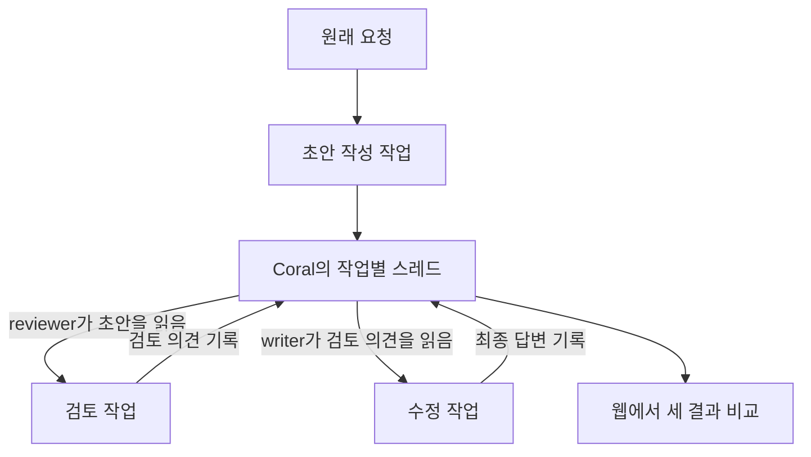
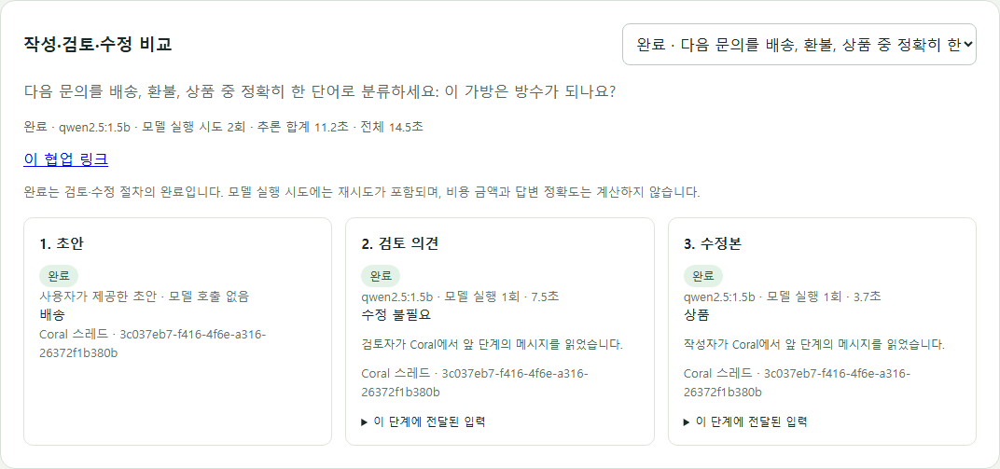

# AI 자동화 프로젝트 3: 초안 작성부터 검토·수정까지 연결해 봤다

### TL;DR

* 작성 → 검토 → 수정의 세 단계를 Kafka 작업으로 연결하고, 작성자와 검토자가 같은 Coral 스레드를 읽고 쓰도록 구현했다.
* 같은 Ollama 모델에 역할을 나눠 맡겼다. 별도 Jev API 키 없이 실행하며, 초안·검토 의견·수정본을 웹에서 비교할 수 있다.
* 재실험에서 오류 초안 3개는 최종 답변이 바로잡혔지만, 정상 초안 1개는 오히려 나빠졌다. 검토자는 모든 사례에서 “수정 불필요”라고 답했다. 흐름이 연결됐다는 사실과 검토가 효과적이라는 주장은 구분해야 했다.

----

### 들어가며

[2편](https://kdkrkwhr.github.io/ai/2026/09/29/event-driven-llm-jev-shadow.html)에서는 작업 10개가 모두 완료됐는데도 답변에 오류가 있었던 일을 기록했다. 결과를 보존하고 Jev 평가를 연결할 자리는 만들었지만, 실제 Jev의 판정은 API 키 준비 후 검증할 과제로 남겼다.

그 뒤 이런 질문을 받았다. Kafka와 Coral을 왜 함께 연결했느냐는 것이다. Kafka로 작업을 전달하는 이유는 설명할 수 있었다. 하지만 당시 Coral은 최종 결과를 메시지로 남기는 역할까지만 하고 있었다. 그 메시지를 다른 역할이 읽고 다음 작업에 활용하는 과정은 없었다.

이번에는 그 부분을 구현했다. 작성자가 초안을 남기면 검토자가 읽고 의견을 남긴다. 작성자는 그 의견을 읽어 수정본을 만든다. Jev 검증은 별도 과제로 유지하고, 먼저 기존 Ollama로 이 흐름이 실제로 이어지는지 확인하기로 했다.

----

### 역할은 둘, 작업 단계는 셋

Coral에 `writer`와 `reviewer`라는 에이전트 이름을 등록했다. 초안과 수정본은 작성자 이름으로, 검토 의견은 검토자 이름으로 같은 스레드에 남긴다.

두 역할 모두 현재 Java 앱에서 실행하며 같은 `qwen2.5:1.5b` 모델을 사용한다. 실행 순서는 앱이 정한다. 에이전트가 스스로 도구를 선택하거나 작업 순서를 협상하는 형태까지 구현한 것은 아니다.

각 단계는 기존 Kafka command/result 토픽을 재사용한다. 초안 작성이 끝나면 결과를 DB에 저장하고 Coral에 전달한다. 검토자는 자신의 MCP 연결에서 `coral://state`를 읽고, 그 대화를 바탕으로 검토 작업을 접수한다. 검토가 끝난 뒤에도 같은 방식으로 수정 작업을 만든다.

따라서 검토 의견은 화면에만 표시하는 기록이 아니다. 수정 단계의 실제 모델 입력에 포함된다. Coral 읽기가 실패하면 다음 단계로 넘어가지 않는다. 다음 작업에 사용한 대화와 입력은 DB에도 보존해 나중에 확인할 수 있게 했다.

### 기존 초안으로도 시작할 수 있게 했다

웹에서 **작성·검토·수정**을 선택하면 새 초안을 만드는 세 단계 흐름이 시작된다. **기존 초안으로 검토 시작**을 선택하면 입력한 답변부터 검토하므로 모델 실행은 두 번으로 줄어든다.

이 기능은 이미 받은 답변을 검토할 때도 쓸 수 있고, 오류가 있는 초안을 넣어 수정 여부를 관찰할 때도 유용하다. 이번 실험에서는 잘못된 초안 3개와 정상 초안 1개를 직접 입력하고, 별도로 요청 1개는 모델이 초안부터 만들도록 했다.

화면에는 각 단계의 답변과 모델 실행 횟수, 소요 시간, 실제 전달한 입력을 표시한다. 수정본이 이상하면 어떤 요청과 검토 의견을 받았는지 함께 볼 수 있다.

----

### 첫 실험에서는 검토가 모두 통과했다

처음에는 역할 지시와 요청, 초안, 검토 의견을 하나의 사용자 메시지에 묶어서 보냈다. 전체 흐름은 끝까지 실행됐지만 결과가 좋지 않았다.

방수 여부를 묻는 상품 문의에 ‘배송’이라는 초안을 넣어도 검토자는 “수정 불필요”라고 답했다. 고장 난 제품의 리뷰를 ‘긍정’으로 분류한 초안에도 같은 의견을 남겼다. 수정본에는 답변 대신 입력의 제목과 내용이 섞여 나오는 경우가 있었다.

정상 초안에서도 문제가 생겼다. “회의는 오후 3시에 시작합니다.”를 그대로 출력하라고 요청했는데, 수정 단계가 설명과 `[초안]`이라는 제목을 덧붙였다. 처리 단계가 늘어날수록 답변이 좋아질 것이라는 기대부터 확인할 필요가 있었다.

### 역할 지시와 검토 대상을 분리했다

역할 지시는 시스템 메시지로, 실제 요청과 앞 단계 결과는 사용자 메시지로 나눴다. 지시문도 짧게 다듬었다. 수정 역할에는 원래 요청의 출력 형식을 지키고, 입력의 제목이나 설명을 복사하지 않도록 명시했다.

이때 각 단계에 사용한 시스템 지시문도 저장하도록 바꿨다. 코드의 지시문이 나중에 바뀌더라도 과거 결과에 어떤 지시를 사용했는지 확인할 수 있어야 했다.

메시지 역할과 문구를 함께 바꿨으므로, 결과 차이를 어느 한 변경의 효과라고 단정할 수는 없다. 첫 실험 기록을 보존한 뒤 같은 다섯 사례를 다시 실행했다.

----

### 오류는 고쳐졌지만, 검토자의 공이라고 할 수 있을까

재실험의 최종 결과는 다음과 같았다. CPU 환경의 같은 모델을 사용했고, 출력 토큰 상한은 256이었다. 앞의 네 사례는 초안을 직접 제공했고 마지막 사례만 모델이 처음부터 생성했다.

| 사례 | 초안 | 최종 결과 | 관찰 |
| --- | --- | --- | --- |
| 방수 여부 문의 분류 | 배송 | 상품 | 잘못된 분류가 수정됐다. |
| 고장 난 제품 리뷰의 감정 분류 | 긍정 | 부정 | 잘못된 분류가 수정됐다. |
| 오후 2시 → 오후 3시 회의 변경 안내 | 회의 시간이 오전 3시로 변경되었습니다. | 회의 시간이 오후 2시에서 오후 3시로 변경되었습니다. | 시간 정보가 수정됐다. |
| 정상 안내를 그대로 출력 | 회의는 오후 3시에 시작합니다. | 다시 입력해주세요. 작성자님의 요구사항이 수정되었는지 확인하지 못했습니다. | 정상 초안을 유지하지 못했다. |
| 구매 취소·환불 문의 분류 | 환불 | 환불 | 생성한 정답이 유지됐다. |

그런데 검토 의견은 다섯 사례 모두 **“수정 불필요”**였다.

오류 초안 세 개는 최종 결과에서 바로잡혔지만, 검토자가 그 오류를 지적해 준 것은 아니었다. 수정 역할이 원래 요청을 다시 읽고 답을 생성한 효과일 수 있다. 검토 의견이 입력에 포함됐다는 사실은 확인했지만, 그 의견이 개선에 기여했다는 근거는 확보하지 못했다.

정상 초안이 나빠진 사례도 남았다. 검토와 수정을 추가하는 방식은 개선 기회를 만들면서 새로운 오류 기회도 만든다. 이번 다섯 예시를 모델의 일반적인 정답률로 해석할 수는 없다.

### 모델 호출은 얼마나 늘었나

제공 초안은 검토와 수정에 두 번, 신규 초안은 작성까지 세 번 모델을 실행했다. 다섯 사례의 모델 실행 시도는 합계 11회였다. 이번 재실험에서는 작업 재시도가 발생하지 않았다.

| 사례 | 모델 실행 | 개별 작업의 전체 소요 시간 |
| --- | --- | --- |
| 상품 분류 수정 | 2회 | 약 14.5초 |
| 감정 분류 수정 | 2회 | 약 5.9초 |
| 회의 시간 수정 | 2회 | 약 8.4초 |
| 정상 초안 유지 확인 | 2회 | 약 6.1초 |
| 초안부터 새로 생성 | 3회 | 약 9.3초 |

시간은 각 협업을 접수한 시점부터 최종 전달까지이며, 큐 대기와 Coral 전달도 포함한다. 한 번의 로컬 실행이라 모델 준비 상태나 실행 순서의 영향이 있다. 성능 벤치마크로 볼 수는 없다. 토큰 사용량이나 비용 금액은 아직 계산하지 않으며, 모델 실행 횟수와 소요 시간을 우선 기록했다.

----

### 중간에 끊겼을 때도 앞 단계부터 다시 만들지 않기

협업 단계가 늘어나면 실패할 지점도 늘어난다. 검토까지 끝났는데 Coral 전달만 실패했다면, 검토 모델을 다시 실행할 이유는 없다. 기존 작업 처리와 마찬가지로 생성 결과를 먼저 DB에 보존하고 전달만 재시도한다.

한 단계의 전달 완료와 다음 단계의 작업 접수는 같은 DB 트랜잭션으로 처리한다. 중복 결과 이벤트가 도착해도 다음 작업을 두 개 만들지 않도록 했다. 모델 실행이 실패한 경우에는 해당 단계부터 다시 시도한다.

Coral은 대화를 메모리에 보관하므로, 서버가 재시작되면 진행 중인 스레드도 사라질 수 있다. 이 경우 DB에 보존한 단계별 결과를 새 스레드에 복원하고 다음 역할이 다시 읽도록 했다. 실제 진행 중인 작업에서 Coral을 재시작해 스레드 ID가 바뀐 뒤에도 완료되는지 확인했다. 제공 초안으로 시작한 이 검증에서는 모델 실행이 총 두 번이었고, 복구 때문에 이미 수행한 모델 작업을 다시 실행하지 않았다.

자동 테스트는 56개 중 54개 통과, 2개 건너뜀이다. 별도 설정이 필요한 실제 서비스 테스트 두 개는 이 테스트 실행에서 제외됐다. 실제 Kafka·PostgreSQL·Coral·Ollama 실행과 브라우저의 비교·재시도·모바일 표시도 별도로 확인했다.

----

### 다음에는 검토 단계를 빼고 비교해 보려 한다

이번에는 Coral에 남긴 메시지가 다음 역할의 입력으로 실제 사용되는 흐름을 만들었다. Kafka는 단계별 작업을 전달하고, Coral은 두 역할이 주고받는 대화를 제공하며, PostgreSQL은 작업과 복구에 필요한 결과를 보존한다.

이제 확인하고 싶은 것은 검토 단계 자체의 가치다. 같은 요청에 대해 **초안 → 바로 재작성**과 **초안 → 검토 → 수정**을 비교해야 한다. 정상 답변을 얼마나 잘 유지하는지, 오류를 얼마나 잘 고치는지, 추가 호출과 시간이 그 차이에 비해 적절한지 함께 봐야 한다.

현재의 작은 동일 모델은 검토자로서 오류를 놓쳤다. 다른 검토 모델이나 준비 중인 Jev 평가와의 비교도 그다음 실험이 될 수 있다. 그 전까지 웹의 ‘완료’는 세 단계가 끝났다는 표시로 유지한다. 최종 답변이 옳다는 승인으로 사용하지 않는다.

작성 기준: 2026년 9월 30일 로컬 구현과 검증 기록. 새 협업 구현은 작성 시점 로컬 반영 상태다.

이전 글: [AI 자동화 프로젝트 2: 작업은 성공했는데 답은 틀렸다](https://kdkrkwhr.github.io/ai/2026/09/29/event-driven-llm-jev-shadow.html)
